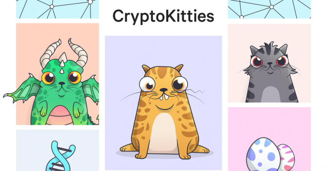
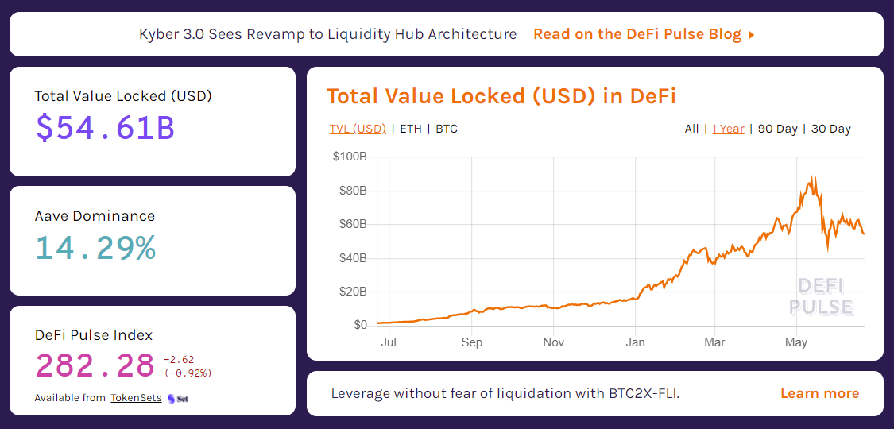
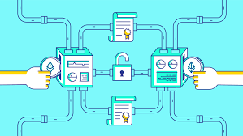
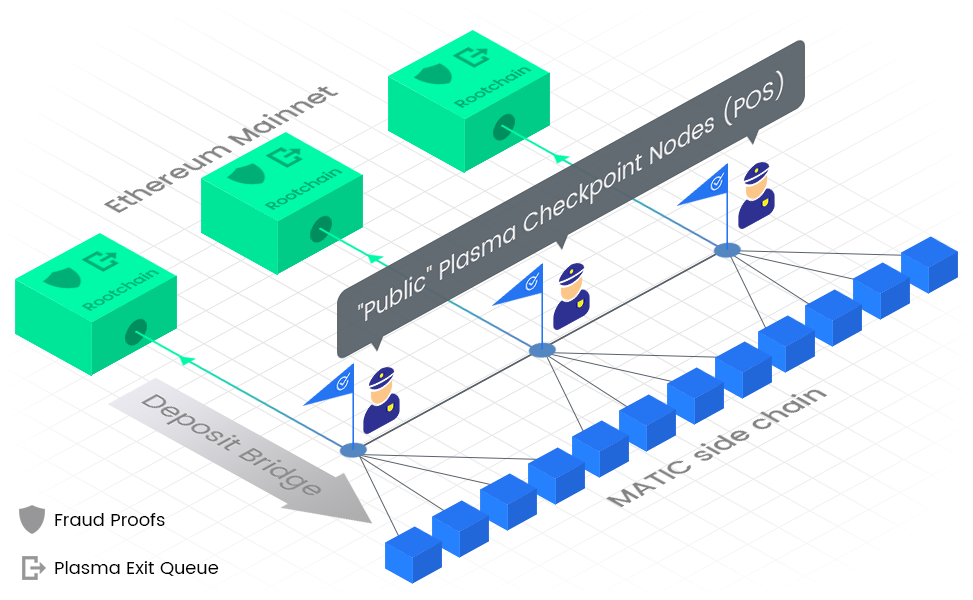
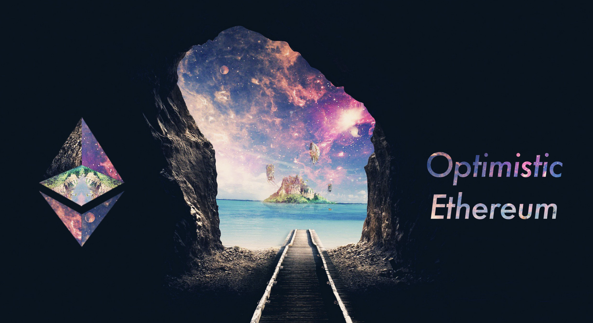
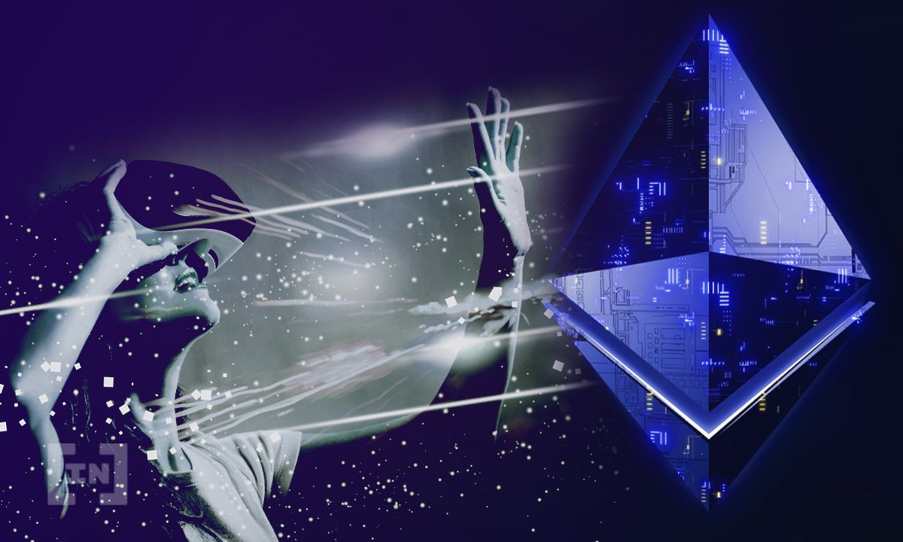

#  이더리움 확장성 이슈가 대두되다

## 첫번째 경고 🟨, 크립토키티

초창기의 이더리움에서는 확장성의 한계가 그리 시급한 이슈가 아니었다. 변변한 DApp 과 ERC-20, ERC-721 토큰 등이 없었을 때의 네트워크는 한산했기 때문이다. 그러던 중 크립토키티가 등장하며, 이더리움의 주요 활용 사례로 부각되면서 엄청나게 많은 트랜잭션을 발생시키게 된다. 거대한 DApp 하나로 이더리움 네트워크가 종종 마비되는 현상을 겪게 되자, 이 시점부터 사람들은 확장성 이슈를 중요한 과제로 생각하게 된다.

이후로 확장성을 위한 솔루션 개발에 집중하게 되고 플라즈마, 롤업, 사이드 체인 등의 다양한 아이디어들이 등장하기 시작했다. 그러던 중 크립토키티의 인기가 사그라들고 트랜잭션이 줄어드는 경향이 보이자, 중요한 이슈로 여겨졌던 확장성 문제도 뒷전으로 밀려났다.

## 두번째 경고 🟨, DeFi

이더리움은 네트워크 상에서의 수수료로 **Gas**라는 연료를 필요로 한다. 현재 이더리움 블록 하나당 쓰일 수 있는 최대 가스량은 12,500,000 이다. 그리고 각 트랜잭션을 제출할 때는 어느 정도의 가스에 해당하는 금액을 수수료로 지출할 지 정할 수 있다. 만약 모든 트랜잭션 수수료가 고정가로 책정된다면, 네트워크 시스템에서 어떤 것을 먼저 처리할지 명확하지 않기 때문에 네트워크가 마비될 수 있다. 이를 방지하기 위해 마치 경매처럼 더 많은 수수료를 지출한 트랜잭션을 먼저 처리하게끔 동작하고 있다.

이러한 시스템 구조 상에서 엄청나게 많은 트랜잭션이 수반되어야 하는 서비스인 DeFi 의 붐이 일자 이더리움 네트워크는 심각한 혼잡 현상을 겪게 된다. 하나의 이더리움 블록에 담을 수 있는 가스의 양이 한정되어 있다보니, DeFi 유저들은 자신이 제출한 트랜잭션이 보다 빨리 처리되게 하기 위해서 더 많은 수수료를 지출하려 하고, 다른 유저와 경쟁하게 되면서 하나의 트랜잭션을 실행시키기 위해서 현화 10만원에 육박하는 때때로는 그 이상의 수수료를 지출해야 하는 경우도 발생했다.

2021년 6월 20일 기준, 근래는 크립토에 대한 관심이 많이 줄어 들면서 트랜잭션 수수료도 많이 줄어든 상태이다. 대표적인 DeFi 중 하나인 UniSwap V3 에서 유동성을 공급하는 트랜잭션이 1분 내로 처리되려면 대략 1만 3천원 정도의 수수료를, 그리고 크립토를 교환 (환전) 하기위해서는 대략 3천원 정도의 수수료를 지출해야 한다. 수수료 가격이 최고점을 찍었을 때에 비하면 많이 나아진 상황이지만, 여전히 자산을 환전하기 위해 지출해야 하는 수수료가 3천원정도이며, 이는 일반적인 유저로서는 부담이 된다는 사실은 여전하다. ([실시간 Gas 확인 사이트](https://www.gasnow.org/))

## 세번째 경고, 🟥 ?

이더리움은 DeFi 만을 위한 전용 플랫폼이 아니다. 단순 토큰 전송부터 NFT 게임, 데이터 저장 등 다양한 DApp 을 위한 플랫폼이다. 지금처럼 DeFi가 이더리움 네트워크 상위권을 지속적으로 차지한다면 당장에는 이더리움의 가격과 헤시레이트가 상승하여 이더리움 네트워크가 높은 안정성을 유지할 수 있을 것이다.

하지만 이런 DeFi 의 트렌드가 장기적으로 유지되어, 이더리움이 DeFi 만을 위한 플랫폼이 되어서 NFT 게임, 소셜 동의 DApp 들이 다른 블록체인으로 떠나면 이더리움 생태계가 단조로워 지면서 서비스가 메말라갈 수도 있다. 그리고 DeFi 의 인기가 사그라들고 트랜잭션 과부하가 없어지면, 이더리움은 타 체인 대비 압도적이었던 다양성과 유저 수를 잃게 될 수도 있다. 그렇게 된다면 이더리움은 타 체인들로부터 강력한 도전을 받아들여야 할 것이고, 어쩌면 탈중앙성도 훼손될 수 있다.

따라서 DeFi 광풍이 꺼졌을 때 이더리움 생태계를 유지하고, 탈중앙성을 지키기 위해서는 **이더리움의 확장성 이슈는 지금 당장 해결해야 하는 사안**이다.

# 앨리스의 이상한 나라

단지 DeFi 때문만이 아니라, 오래전부터 이더리움을 비롯한 대부분의 블록체인에서 확장성 문제는 많이 연구되고 있다. 이더리움의 경우, 네트워크 구조 자체를 개선함으로써 해결하고자 하는 이더리움 2.0 업데이트와 그에 덧붙여 더 높은 확장성을 가질 수 있도록 Layer-2 를 구축하려는 시도, 크게는 두 가지로 나누어 볼 수 있다. 이 둘을 기술적인 설명을 최소화하고 대표되는 개념들을 우화 형태로 알아보려 한다. 아래의 예시 우화의 출처는 [Onther Medium 포스팅](https://medium.com/onther-tech/the-next-layer-2-%EC%9D%B4%EB%8D%94%EB%A6%AC%EC%9B%80%EC%9D%80-%EC%96%B4%EB%96%BB%EA%B2%8C-%EB%B0%9C%EC%A0%84%ED%95%B4-%EC%99%94%EB%8A%94%EA%B0%80-eb5fe06cd0c1)이다.

## 이더리움 1.x

앨리스의 나라는 상업이 아주 발달한 나라이다. 그런데 특이하게도 사람들 간의 복잡한 거래 기록 (`트랜잭션`) 들을 네모난 상자 (`블록`) 에 하나하나 보관하여 기록하는 이상한 나라다.

이상한 나라에는 이러한 상자를 만드는 이상한 공장 (`이더리움`) 과 여러 장인 (`채굴자`) 들이 있다. 이 공장에서 장인들은 평소대로 열심히 상자를 만들고 있었다. 그런데 언젠가부터 사람들의 원성이 높아지기 시작했다. 알고 보니 여러 명의 장인들이 열심히 상자를 제작하고 있음에도 불구하고, 이상한 나라의 경제 활동이 워낙 활발해져 사람들의 모든 거래들을 기록하고 보관하기에는 상자가 턱없이 모자라는 상황 (`확장성 문제`) 이 발생한 것이다.

이러한 상황이 지속되자 일부 사람들은 이를 견디지 못하고 새로운 해결책을 제시하겠다고 나선다. 바로 새로운 공장 (`새로운 블록체인`) 을 세워 더 큰 모양의 상자를 건설하겠다는 것이다.

새로운 공장들은 모두 이상한 공장에 비해 다양한 장점들을 내세워 사람들을 향해 홍보하기 시작했다. 대체로 이런 공장들의 특징은 짧은 시간 동안 많은 양의 상자를 생산한다는 것이었다. 때문에 수많은 사람들의 경제 활동을 처리하기에 매우 효율적인 것처럼 보였다. 하지만 이내 새로운 공장에서 생산된 상자에는 치명적인 문제들 (`탈중앙성 결여, 안정성 부족 등`) 이 있다는 것이 밝혀졌다.

사실 이상한 공장은 상자를 일부러 천천히 만들려 한 것은 아니다. **하지만 수많은 사람들이 사는 이상한 나라의 경제를 다루기 때문에 최대한 신중하고 안전하게 상자를 생산할 수 밖에 없었던 것이다.** 그래서 이상한 공장에서는 상자를 안전하게 만들기 위해 몇 가지 원칙 (`합의 알고리즘`) 을 정해두었다.

- 상자를 만들기 위해서는 특수한 공구 (`마이닝 장비`) 를 이용하여 제대로 제작해야 한다.
- 상자를 제작하고 상자의 품질을 검수하는 과정에는 누구나 참여할 수 있다. 상자가 불량이라면 누구나 이를 폐기 처분할 수 있다.
- 상자를 가장 먼저 제작한 장인에게 보상이 주어지고, 해당 상자가 늦게 생산된 다른 동일한 상자에 비해 우선 (`Longest Chain Rule`) 한다.

이러한 원칙들을 통해 이상한 공장은 상자를 빠르게 그리고 더 크게 만들지는 못했지만, 무엇보다 누구나 상자 제작에 참여할 수 있다 (`탈중앙성`) 는 규칙을 지키며 안전하고 꾸준하게 상자들이 제작 (`안정성`) 될 수 있도록 했다.

반면에 새로운 공장들은 이러한 기본적인 원칙이 잘 지켜지지 않았다. 예컨대, 상자를 제작할 수 있는 권한을 소수의 관계자만이 독점할 수 있게 방조하거나 (`탈중앙성 문제`) , 상자의 품질이 제대로 검수될 수 없는 환경 (`안전성 문제`) 을 조성했다. 이 뿐만 아니라 새로운 공장에는 매우 치명적인 단점이 존재했는데, **새로운 공장의 상자는 이상한 공장의 상자와 호환되지 않는다는 점**이다. 앨리스의 나라에서는 이미 수많은 경제 활동이 이상한 공장의 상자를 기준으로 처리되고 있었고, 이는 대부분의 사람들이 새로운 상자들의 이점에도 불구하고 외면할 수 밖에 없게 만들었다.

> 만약 현실 세계에서 우리가 잘 사용하고 있는 원화를 갑자기 사용하지 않고, 진돗개 코인이라는 새로운 화폐를 만들어 사용하자고 할 때 우리는 어떻게 행동할까? 진돗개 코인이 원화에 비해 몇 가지 좋은 점이 있더라도 아마 우리는 수많은 불편을 느낄 것이고, 정말 특별한 경우 (예를 들어, 원화가 심각하게 그 기능을 상실했을 경우) 가 아니라면 그대로 원화를 사용하는 것을 택할 것이다.

여기까지가 불과 1~2년전의 블록체인, 그리고 이더리움 세상의 이야기이다. 이더리움은 끊임없이 확장성 문제에 부딪혀왔고, 이를 해결하겠다며 새로운 블록체인들이 수없이 등장했지만 결국은 위와 같은 문제에 부딪혀 이더리움 이상의 역할을 해내지 못하고 있다. 이러한 과정에서 이더리움 생태계는 스스로 문제를 해결하기 위해 **이더리움 2.0**과 **Layer-2 솔루션**이라는 두 가지 돌파구를 찾게 된다. 이를 알아보기 위해 다시 앨리스의 이상한 나라로 떠나보자.

## 이더리움 2.0

이상한 공장의 문제는 누구나 알고 있었던 만큼 이 공장의 창업주들 (`이더리움 커뮤니티`) 또한 이를 잘 알고 있었다. 이상한 공장의 창업주들은 오랫동안 이 문제를 개선하기 위해 노력해왔고, 어느 날 드디어 그 개선안 (`이더리움 2.0`) 을 모두에게 공개했다. 이 개선안은 매우 복잡했지만 그 핵심은 다음과 같다.

- 오직 값비싼 공구를 가진 사람들만 상자를 만들 필요가 있는가, 공장의 주식을 발행해 **주식을 보증금 (`이더 예치`) 으로 예치한 사람이면 누구나 상자를 생산하고 검수할 수 있어야** 한다. (`작업증명 (Proof of Work) 에서 지분증명 (Proof of Stake) 로의 전환`)
- **공장의 수를 하나에서 수십, 수백 개로 늘려 상자를 생산하고, 이를 하나의 공장으로 모아 압축하자. 더불어 여러 공장에서 생산되는 모든 상자는 서로 호환 가능해야** 한다. (`샤딩 (Sharding)`)

곧 이상한 나라의 사람들은 이 개선안을 바탕으로 이상한 공장을 바꾸는 작업에 착수했다. 그 결과 첫 단추인 상자를 제작하는 권한과 과정의 일부를 변경 (`이더리움 2.0 Phase 0`) 하는데 성공했다. 즉 값비싼 공구를 보유하지 않아도, 공장의 주식을 조금만 예치하면 누구나 상자를 제작할 수 있게 되었다.

하지만 아직 문제가 해결된 게 아니다. 상자를 생산하는 권한과 방식에만 변경이 있었을 뿐, 가장 중요한 상자 생산 공장의 확대는 이루어지지 않았다. 즉, 상자를 생산하는 공장은 여전히 단 하나이기 때문에 상자의 크기나 생산 속도 등은 개선이 되지 않은 것이다. 상자 공장을 수백 개로 확대하는 과정 (`이더리움 2.0 Phase 1, 2`) 은 매우 복잡하고 시간이 많이 소요되는 작업이다. 이는 최소 수년 이상이 필요한 작업이었고, 이상한 나라의 시민들은 그 기간동안 불편을 느끼며 살아갈 수 밖에 없었다. 이에 사람들은 또 다른 해결책을 찾아 나섰다.

## Layer-2 솔루션, 또 다른 돌파구

이상한 나라의 일부 관계자들은 오래 전부터 또 다른 보완책을 연구하고 있었다. 이상한 공장 자체를 완전히 탈바꿈하는 방법보다는 불완전한 해결 방법이지만, 그보다 덜 복잡하고 빠른 시일 내에 도입할 수 있는 방법으로써, 이상한 공장의 보조 공장 (`Layer-2 솔루션`) 들을 만들어 상자를 생산하고 이를 다시 이상한 공장으로 보내 하나의 이상한 상자 (`이더리움 블록`) 로 합치는 것 `(커밋 (Commit)`) 이었다.

이때 중요한 점은 하나의 상자로 합치는 과정에서 보조 상자가 올바르게 제작되었는지, 어떠한 거래 내역이 포함되었는지를 이상한 공장에서 하나하나 직접 검수하지 않는다는 것이다. 단순히 보조 공장주들이 상자를 소위 말해 찍어내고 이를 이상한 공장으로 보내게 된다.

이는 보조 공장의 장점이자 동시에 단점이다. 검수 과정을 별도로 거치지 않기 때문에 여러 상자를 손쉽게 만들어 이를 하나의 이상한 상자로 압축하여 더 많은 거래 활동을 담아 효율을 높일 수 있지만, 반대로 이로 인해 악덕 보조 공장주가 선량한 사람들에게 피해를 입힐 수도 있기 때문이다.

> 트랜잭션들을 오프체인 (Off-Chain) 에서 처리하여 확장성을 높이는 Layer-2 솔루션이 이더리움 2.0의 샤딩 (Sharding) 과 유사하게 보일 수 있지만 그 내면은 전혀 다르다. Layer-2의 블록들은 베이스 레이어 (Base-Layer), 즉 이더리움 또는 이더리움 2.0의 검증인들이 유효성 (Validity) 을 직접 검증하지 않는다. 반대로 이더리움 2.0의 모든 샤드체인들은 유효성을 각 샤드의 검증인들이 직접 검증하는 구조이다.

악덕 보조 공장주가 선량한 사람들을 위협할 수 있는 방법은 크게 두 가지가 있다.

- 고의적으로 보조 공장에서 생산된 상자를 조작하여 경제적인 피해를 유발한다.

- 상자에 포함된 거래 내역을 공개하지 않아 `(데이터 가용성 문제 (Data Unavailability)`) 선량한 사람들이 정상적으로 경제 활동을 할 수 없게 만든다.

  > 우리가 평소에 은행에서 거래 (입금, 출금, 송금 등) 할 때마다 그 내역이 모두 기록이 되고 직접 확인할 수 있다. 하지만 만약에 은행이 이를 우리에게 알려주지 않는 경우에는 어떨까? 예를 들어 친구 A에게 1백만원을 송금한 경우, 은행이 송금이 제대로 된 것인지, 그렇지 않은지 도무지 알려 주지를 않는 것이다. 그러면 사용자들은 매우 불안해 질 것이다. 자신의 계좌에 1백만원이 여전히 남아 있는 것인지 아니면 제대로 송금이 된 것인지, 혹은 아예 증발해 버린 것인지 혼란스러워진다. 두 번째 방법은 바로 이러한 상황을 말하는 것이다.

이 두 가지 문제에 대해 사람들은 저마다 각각의 해결 방식을 내놓았고, 이는 크게 네 가지 방식으로 분류되었다. 이제 이 네 가지 방식에 대해 알아보도록 하자.

### 플라즈마

가장 먼저 사람들은 이러한 아이디어를 떠올렸다.

- 상자를 조작하는 것은 누구든지 이를 이상한 공장의 검수인에게 고발할 수 있는 창구 (`위조 증명 (Fraud Proof)`) 를 만들어 해결한다.
- 상자의 내역을 숨기는 것은 내역을 숨기는 순간부터 그 보조 공장에서 안전하게 출금 (`탈출 (Exit)`) 하여 떠날 수 있는 시간을 주면 된다.

하지만 여기에는 큰 함정이 존재한다. 바로 악덕 공장주가 상자를 숨겨버리면 그 때부터 내 돈이 제대로 관리되고 있는지 알 수가 없어진다는 점이다. 앞서 문제가 생겼을 때 고발할 수 있는 창구를 마련한다고 했는데, 이 고발이라는 것도 증거가 있어야 가능할 것이다. 그런데 이 공장주가 모든 것을 숨겨버린다면 그 때부터 아무런 증거도 구할 수가 없게 된다.

> 이것이 바로 플라즈마의 악명 높은 데이터 가용성 문제이다. 일단 데이터 가용성 문제가 발생하면 위조 증명 (Fraud Proof) 을 통해 문제를 해결할 수 없기 때문에 해당 플라즈마 체인에서 탈출 (Exit) 하는 방법밖에 해결 방법이 없다. 이는 플라즈마를 안전성 (Security) 측면에서 매우 취약하게 만들었다. 문제의 해결 방법이 개별 사용자의 탈출 밖에 없었기 때문이다.

때문에 사람들은 공장주가 제대로 상자를 생산하고 있는지, 공정 과정을 모두에게 투명하게 공개 하고 있는지 등을 계속해서 감시하고 있어야 했다. 상자 위조는 누군가 한 명만 이를 발견한 후 고발해도 해결이 되는 문제지만, 상자에 대한 정보가 공개되지 않는다면 긴급하게 출금을 요청해야 하기 때문이다.

하지만 이 방식은 오직 단점만 있는 것은 아니다. 보조 공장에서 생산된 상자에 포함된 거래 내역을 직접적으로 지상의 상자에 포함하지 않기 때문에 더 많은 거래들을 처리할 수 있게 될 것이다. (이 점은 아래 Optimistic Rollup과 완전히 대비되는 부분)

> 즉, 플라즈마는 확장성을 개선하는 데는 많은 도움이 될 수 있지만, 이는 어느 정도의 안전성을 담보로 할 수 밖에 없는 방법이다. 만약, 안전성이 크게 중요하지 않은 대신 많은 양의 트랜잭션을 처리할 필요가 있다면 이는 플라즈마를 사용하는 것이 매우 적합할 것이다.

### Optimistic Rollup

앞선 아이디어의 한계를 느꼈던 일부 사람들은 다시 이렇게 생각을 하기 시작했다. '거래 기록 자체는 신뢰할 수 있는 이상한 상자에 기록 (`롤업 (Rollup)`) 하는 대신, 각 거래를 처리하는 활동은 보조 공장의 상자에서 처리하면 어떨까’ 하고 말이다.

이는 상당히 일리가 있는 생각이었다. 하지만 그냥 모든 것들을 이상한 상자에 기록하고 처리하는 것과 무엇이 다르냐고 의문이 생길 수도 있다. 이렇게 한번 생각을 해보자. 은행에서 친구 A에게 1백만원을 송금한다면, 대략 이러한 과정을 거치게 될 것이다.

1. ‘나’로부터 ‘A’에게 1백만원 송금 (기록)
2. ‘나’의 계좌에서 1백만원 차감 / ‘A’의 계좌에서 1백만원 추가 (처리)

이 새로운 방식의 특징은 바로 1번 과정만 이상한 상자에 기록하고 실질적인 거래 처리 과정인 2번은 모두 보조 상자에서 처리한다는 것이다. 만약 단순한 송금이 아니라 더 복잡한 경제 활동을 다룬다면 2번 과정이 매우 복잡해 질 것이고, 이를 보조 공장에서 처리하게 된다면 매우 효율적일 수 있다.

앞서 플라즈마에서는 악덕 공장주가 상자에 대한 정보를 숨겨버리는 것이 큰 문제가 되었다. 하지만 여기에서는 더 이상 그런 일이 발생할 수가 없다. 이상한 상자에 보조 공장에서 처리할 모든 거래 내역들을 **기록’만’** 하기 때문이다.

하지만 이 방식 또한 완벽하지는 않다. 거래 내역만 따로 이상한 상자에 기록한다고 했지만 그 양이 만만치가 않기 때문이다. 더 효율적으로 상자를 생산하겠다고 보조 공장까지 따로 세웠는데, 막상 보조 공장에서는 거래를 처리하는 역할만 맡기 때문에 이상한 공장의 모든 문제를 해결하기에는 그 한계가 명확했다.

### ZK Rollup

앞서 등장한 두 가지 방식은 모두 거래 기록을 이상한 공장에서 기록하느냐 혹은 하지 않느냐의 차이가 있었을 뿐, 악덕 공장주가 상자를 위조할 경우 누군가 나서서 이를 고발한다는 방식 자체는 동일했다. 만약에 누군가 이를 고발할 필요도 없이 보조 공장에서 상자를 생산하는 그 즉시 그 상자가 제대로 제작되었음을 증명할 수 있고, 거래 내역도 모두 확인할 수 있다면 어떨까? 사람들은 더 이상 공장주가 나쁜 짓을 하는지 아닌지 감시조차 할 필요도 없어지기 때문에 매우 편리할 것이다.

이러한 아이디어를 바탕으로 이상한 나라의 마법사들은 상자 제작과 동시에 상자가 올바르게 제작되었음을 증명하는 기발한 마법 (`영지식증명`) 을 개발했다. 이 마법을 이용하면 보조 공장주가 상자를 위조하는 것 자체가 불가능했다. 잘못된 보조 상자는 마법이 걸리지 않았고, 이는 단번에 이상한 공장에서 알아챌 수 있었기 때문이다.

하지만 마법은 언제나 막대한 에너지를 필요로 하곤 한다. 앨리스의 나라에서도 마찬가지였다. 마법은 너무나 많은 에너지를 필요로 했기 때문에, 보조 상자에 포함된 거래가 조금이라도 복잡하거나 양이 많다면 마법을 거는데 막대한 시간이 걸렸다. 물론 비교적 단순한 거래 활동들은 쉽게 마법으로 처리할 수 있었기 때문에 주로 단순한 송금들을 처리하는 데는 뛰어난 성능을 발휘할 수 있다.

### Validium

앞서 등장한 마법에서 상자가 올바르게 제작되었음을 증명하는 과정 자체는 그대로 두고, 거래 내역은 플라즈마와 같이 이상한 상자에 기록하지 않는다면 어떨까요? 아마 플라즈마와 같이 확장성 측면에서 큰 도움이 될 것이다. 게다가 상자 조작도 불가능하니 아주 안전하기도 할 것이다.

물론, 이 경우에도 여전히 악덕 공장주가 상자를 숨겨버린다면 사람들은 매우 불편해진다. 송금이 올바르게 되었다는 것은 확신할 수 있겠지만 (마법이 걸려있기 때문) 거래 내역을 확인할 수 없다면, 계속해서 거래 활동을 하는 것은 불가능할 것이다. (마치 송금은 잘되지만 잔액 조회가 안되는 상황) 이러한 문제가 발생한다면 아마도 사람들은 여기서 탈출하는 수 밖에 없다. 물론 어떠한 상황에서도 자신의 자산은 안전하게 지켜지기 때문에 이런 상황이 플라즈마보다는 덜 걱정스러울 것이다. 모든 것이 다 좋아 보이지만 이 방식 또한 여전히 마법의 한계가 존재한다. 바로 복잡한 거래들은 다룰 수 없다는 것이다.

### 우세한 솔루션 ?

Layer-2 솔루션에는 앞서 살펴본 것처럼 상당히 다양한 종류가 있다. 아무런 이유 없이 단순히 종류가 많은 것은 아니다. 각 솔루션마다 장단점이 있기 마련이다. 따라서 유저들은 여러 종류의 Layer-2 솔루션 간에는 명확히 장단점이 존재하며, 사용 목적에 따라 적합한 솔루션을 선택하는 것이 중요함을 명심해야 한다.

이는 마치 여러 종류의 공구들이 각기 다른 곳에 쓰임새가 있는 것과 유사하다. 굴삭기는 대규모 토목 공사에, 곡괭이는 단단한 암석을 부수는데, 모종삽은 작은 정원을 꾸미는 데 쓰이는 것처럼 말이다. 따라서 한 가지 분명한 것은 **Layer-2 솔루션이 근시일 내에 현실적인 확장성 솔루션으로 자리 잡음과 동시에 다양한 종류의 Layer-2 솔루션들이 사용될 것**이라는 점이다.

# 여러 솔루션의 등장과 도전

이더리움을 사용하는 사람들과 서버스들이 늘어감에 따라, 위에서 언급했던 것처럼, 블록체인은 확장성에 있어서 한계를 직면하게 되었다. 그래서 해결책들이 많이 연구되고 있고, 테스트를 마치고 실제 구현하여 서비스에서 구동되고 있는 방안도 있다.

확장성을 개선해야 함의 주요 목표는 다음과 같다.

- 트랜잭션 처리 속도를 높여, 블록체인 Finality 를 더욱 빠르게 처리되도록 하는 것
- TPS라고 하는 초당 트랜잭션 처리량을 높이되, 탈중앙성 혹은 안정성 (보안성) 을 유지하는 것

목표를 달성하기 위한 방법이 두 가지가 있는데, 첫번째 방법은 블록체인 자체의 트랜잭션 처리 능력을 높이는 것이다. 이때의 주요 난제는 더 커진 블록으로 구성된 블록체인 검증을 어렵게 하고 이 때문에 더 중앙화될 수 있다는 점이다. 이런 리스크를 피하기 위해 개발자들은 클라이언트의 효율을 높이거나, 샤딩과 같은 기술을 적용하여 체인을 구축하고 검증하는 작업이 여러 노드들에게 분산되도록 하는, 보다 지속 가능한 방법이 있다. 이 방식이 바로 Eth 2.0 프로젝트에서 하고자 하는 것이다. 보다 자세한 설명은 [이전 포스팅](https://velog.io/@tmdgh0221/%EC%9D%B4%EB%8D%94%EB%A6%AC%EC%9B%80-2.0-Phase-0-%EC%9D%B4%ED%95%B4%ED%95%98%EA%B8%B0)을 참고하길 바란다.

다른 하나는 블록체인을 사용하는 방법을 바꾸는 것이다. 블록체인에 모든 것을 집어넣는 대신 Layer 2 프로토콜의 Off-Chain 에서 대부분의 작업을 행하도록 말이다. On-Chain 에는 Off-Chain 에서 이뤄지고 있는 작업들이 정해진 규칙을 따르고 있다는 증명을 검증되기만 하면 된다. 이렇게 하면 On-Chain 에서 증명을 검증하는 것이 Off-Chain 에서 원래의 연산을 수행하는 것보다 훨씬 경제적이다. 보다 자세한 방안들을 살펴보자.

## State Channels

예시를 통해 어떻게 동작하는 지 살펴보자. 앨리스가 밥에게 인터넷 연결을 제공하고, 밥이 앨리스에게 1MB 당 $0.001 을 지불한다고 하자. 이런 경우에, 각 지불 건마다 트랜잭션을 실행하는 대신 State Channel 방식을 사용할 수 있다.

먼저 밥이 스마트 컨트랙트에 $1 와 동등한 가치의 자산을 예치한다. 밥은 앨리스에게 요금을 지불하기 위해 $.001 라고 적힌 티켓 (Off-Chain 메시지) 에 서명하여 보내고, 이후 두 번째 요금을 지불할 때는 $0.002 라고 적힌 다른 티켓에 서명하여 앨리스에게 보낸다. 지불이 필요한 만큼 동일한 과정을 반복한다.

그리고 앨리스와 밥의 거래를 마치면, 앨리스는 가장 높은 가격이 써있는 티켓에 서명하여 블록체인에 배포한다. 스마트 컨트랙트는 앨리스와 밥의 서명을 검증하고, 밥의 티켓에 적혀 있는 만큼 앨리스에게 지불한 뒤 차액을 밥에게 반환한다. 앨리스가 둘 간의 채널 닫기를 원치 않을 경우 (악의적이거나 어떤 기술적 이슈로 인해) , 밥은 출금 기간 (e.g. 7일) 을 개시할 수 있고, 앨리스가 해당 기간 내에 티켓을 제공하지 않을 경우 돈을 돌려받는다.

이 방식은 양방향 지불, 스마트 컨트랙트 (e.g. 채널 내에서 앨리스와 밥이 맺는 금융 계약), 추가적인 구성 (e.g. 앨리스와 밥 사이에 채널이 있고 밥과 찰리 사이에도 채널이 있다면, 앨리스는 찰리와 신뢰 관계 없이도 소통할 수 있음) 등을 처리할 수 있다. 하지만 채널에 참여하지 않은 사람에게 Off-Chain 자산을 전송할 수 없다. 단순한 지불 결제가 반복되는 경우 보다는 큰 규모의 자본이 복잡한 목적으로 사용될 경우에 적합하다.

## Plasma

플라즈마 체인의 동작 방식을 살펴보자. 메인 체인으로부터 자산을 입금하기 위해 플라즈마 체인을 관리하는 스마트 컨트랙트에 자산을 전송하면, 플라즈마 체인은 그 자산에 새로운 고유 ID 를 할당한다. 각 플라즈마 체인에는 Operator (Multisig 혹은 DPOS 와 같은 방식) 이 존재하여, Operator 가 각 주기마다 Off-Chain 에서 수신한 모든 플라즈마 트랜잭션을 모아서 Batch 트랜잭션을 생성한다. 여기서 계산된 트리의 머클 루트를 메인 체인에 배포하여 유저가 출금할 수 있도록 구성된다.

여기에 스마트 컨트랙트에서 챌린지 기간을 개시하여 누구든 머클 브랜치라는 증거를 제출 및 증명하여 해당 유저가 Plasma로부터 Exit (탈출) 하려는 시도를 무력화할 수 있도록 한다. 챌린지 기간을 무사히 넘기면, 유저는 자산을 출금할 수 있다.

플라즈마 체인을 이용하는 방식은 해당 체인을 사용하지 않는 유저에게도 자산을 보낼 수 있다는 강점이 있다. 그러나 State Channels 방식에서 정상 작동 중에는 어떠한 데이터도 On-Chain 에 보낼 필요가 없지만, 플라즈마는 각 플라즈마 체인이 주기적으로 해시 값을 메인 체인에 제출해야 한다. 이 점에 추가 비용이 발생하고, 더불어 플라즈마 체인에서 이루어진 자산 전송은 챌린지 기간이 끝나고 메인 체인의 블록이 생성되기까지 기다려야 하기 때문에 즉각적으로 트랜잭션이 처리되지 않는 약점이 있다.

이외에도 Plasma 와 State Channels 은 공통적인 취약점이 있다. 이 둘이 안전하다는 것을 설명하는 게임 이론에서 시스템의 통제를 받는 대상이 논리적인 Owner 로 지칭될 수 있다. 만약 특정 Owner 가 자신의 자산에 무신경하다면 그 자산에 잘못된 트랜잭션이 발생해서 올바르지 않은 결과가 발생할 수 있다. 또한 UniSwap 과 같이 Owner 합의 없이 자산이 변경되는 시스템 (e.g. 다른 유저의 동의 없이 본인 잔고를 증가시키는 Accoun 기반 시스템) 들 역시 Plasma 와 궁합이 좋지 않다. 어떤 Plasma 나 State Channels 배포 시 각 애플리케이션 별 최적화가 필요하기 때문에 EVM 을 시뮬레이션하는 것이 불가능하다.

## Rollups

Plsama 와 State Channel 은 **완전한** Layer-2 방식으로, 데이터와 연산 과정 모두를 Off-Chain 으로 이동시키고자 하지만, 데이터 가용성 문제를 둘러싼 근본적인 게임 이론 이슈에 따르면 모든 애플리케이션들을 동작하게 하는 것은 불가능하다. 반면 Rollups 은 **하이브리드** Layer-2 방식으로, 연산 과정과 State Storage 를 Off-Chain 에서 처리하지만, 트랜잭션마다 약간의 데이터를 On-Chain 에 유지한다.

여기서 핵심은 데이터가 On-Chain 에 있다는 점이다. 이는 곧 누구나 자신이 원할 때 로컬에서 Rollup 내 모든 작업을 처리, 부정 행위 감지, 출금 개시, 트랜잭션 배치 생성 등 것들을 가능할 수 있다는 애기다. 즉, 데이터 가용성 문제가 근본적으로 해결되어 더 이상 자산과 소유자를 맵핑할 필요가 없으며, Rollup 내부에서 EVM 을 돌려보는 것들이 가능하다. 이러한 점들 때문에 다양한 Layer-2 방식들 중에서도 Rollup 이 더 주목받고 있는 이유이다.

Rollup 에서 주요 포인트는 Rollup 내부에서 발생한 트랜잭션을 메인 체인 (이더리움) 에 제출하는 과정에서 문제가 없는 지 확인하는 과정이다. 만약 누군가가 어떠한 검증도 없이 무작위로 제출하는 것이 가능하다면, Operator가 악의적인 행동을 취할 수도 있다. 여기서 이를 방지하는 방식에 따라서 Rollup 이 크게 두 가지로 나뉜다.

- **Fraud Proofs** (거짓 증명) 을 사용하는 **Optimistic Rollups**

  

  Optimistic Rollup은 누군가 Rollup에 잘못된 트랜잭션을 제출하면, 체인을 유지하던 다른 누구나 해당 거짓 행위를 감지하고 거짓 증명을 제출하여, 해당 트랜잭션이 잘못되었고 번복되어야 함을 스마트 컨트랙트에 증명할 수 있다는 아이디어에 기반한다.

- **Validity Proofs** (유효 증명) 을 사용하는 **ZK Rollups**

  
  
  ZK Rollup은 Layer-2 내의 트랜잭션을 Layer-1 에 제출할 때, 영지식 증명을 활용하여 제출된 트랜잭션이 문제없음을 검증하는 아이디어를 기반으로 한다.

각 증명 방식으로 인해 두 가지 Rollup 은 명확한 차이를 보인다.

|                               | Optimistic Rollups                                           | ZK Rollups                                                   |
| ----------------------------- | ------------------------------------------------------------ | ------------------------------------------------------------ |
| 출금 기간                     | 약 1주 (거짓 증명을 배포하고 만약 입증될 경우 출금을 취소하기 위한 시간 확보를 위해 출금 지연이 필요) | 매우 빠름 (다음 트랜잭션 제출까지의 시간만 필요)             |
| 기술 복잡도                   | 낮음                                                         | 높음 (영지식 증명은 수학적으로 상당히 복잡한 최근 기술)      |
| 트랜잭션 당 On-Chain Gas 비용 | 높음 (거짓 증명에 사용될 경우를 대비하여 히스토리 데이터가 기록되어야 함) | 낮음 (트랜잭션 내의 데이터가 검증 목적으로만 사용되고 상태를 변경하지 않기 때문에 기록될 필요 없음) |
| Off-Chain 연산 비용           | 낮음                                                         | 높음 (영지식 증명 비용이 높음)                               |

대체로 Optimistic Rollups 이 범용 EVM 연산에서 우위를 점할 가능성이 높고, ZK Rollups 은 단순 지불 결제나 일부 특정 활용 방안에 한해 우위를 점할 가능성이 높으며, 중장기적으로는 ZK-SNARK 등의 영지식 증명 기술 개선에 따라 대부분의 경우에 대해서 ZK Rollups 이 승리를 가져갈 가능성이 높다.

## Sidechains

메인 체인인 이더리움과 같은 레벨 상에서 독립적으로 동작하는 별도의 블록체인을 사용하는 방식이다. 독립적인 블록체인이 동작하는 것이므로 이더리움과 상관없이 PoA (Proof of Authority), DPoS (Delegated Proof of Stake) 등의 합의 메커니즘을 사용할 수 있다. 이렇게 동작하는 Sidechain을 양방향 Bridge를 활용해 이더리움과 연동해 확장할 수 있다.

## Validium

ZK Rollups 처럼 Validity Proof 를 이용하지만, 메인 체인에 트랜잭션 기록을 하지 않는 방식이다. 아직 활발히 연구되고 있는 솔루션이다.

# 마치며

이번 포스팅에서는 이더리움 확장성 문제가 시급히 해결되어야 하는 이유와 여러 해결책들을 살펴봤다. 이후 이어지는 포스팅에서는 현재까지 개발되고 실제 동작하고 있는 Layer-2 솔루션들을 살펴보고, 이러한 솔루션들의 한계점 및 개선점을 알아보려 한다.

## Reference

[Onther Medium Posting 01](https://medium.com/onther-tech/the-next-layer-2-defi%EA%B0%80-%EA%B0%80%EC%A0%B8%EC%98%A8-%EC%9D%B4%EB%8D%94%EB%A6%AC%EC%9B%80-%ED%99%95%EC%9E%A5%EC%84%B1-%EC%9D%B4%EC%8A%88-d4ef1ce97dfc)

[Ethereum Official Website](https://ethereum.org/en/)

[Vitalik Buterin Blog Post](https://vitalik.ca/general/2021/01/05/rollup.html)

