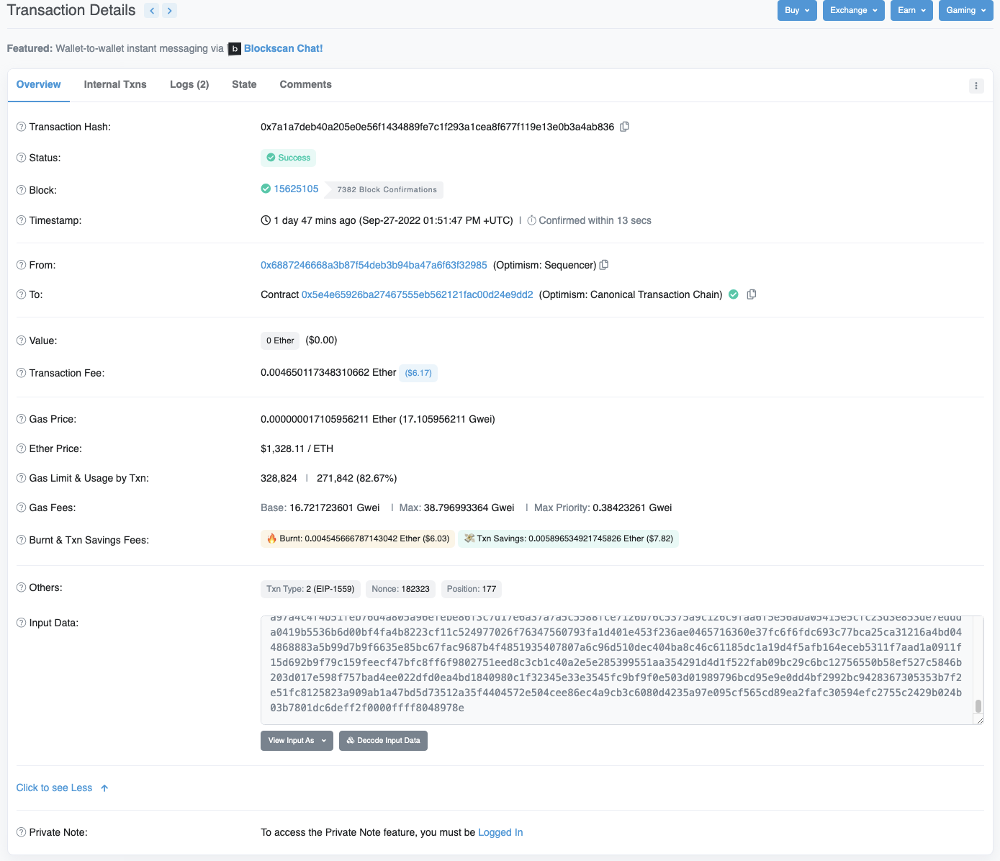
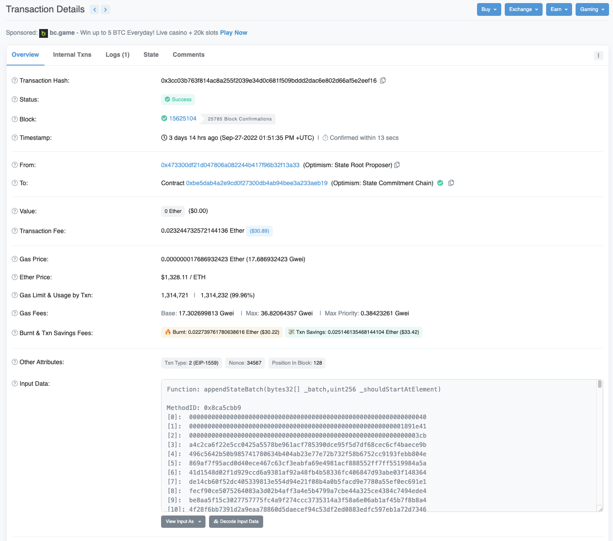
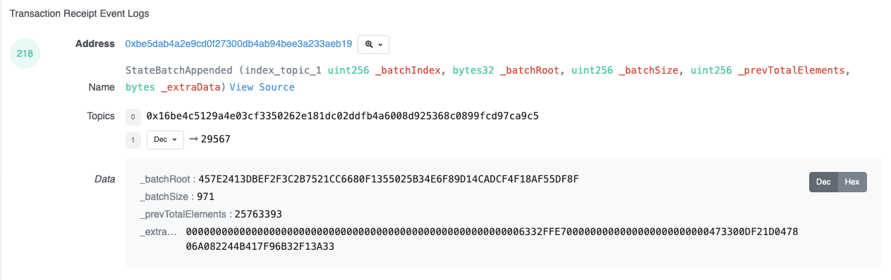

## Optimism
> 아래 진행한 코드는  `scratch/optimism-data-availability/` 경로에 올려놓았다.

### How Tx Stored (L2 -> L1)
[Optimism 공식 문서](https://community.optimism.io/docs/protocol/protocol-2.0/#canonicaltransactionchain-ctc)에 들어가보면, 어떤 방식으로 L2의 트랜잭션들을 L1로 저장하는지 대략적으로 기술되어 있다.
타 Layer 2와 비교하여 Rollup이 가지는 강점이 Data Availability이기 때문에 이를 어떻게 구현하였는지 확인해보아야 한다.

L1에 롤업할 때는 Calldata라는 공간에 Batch로 L2 트랜잭션들을 기록한다.
예를 들면, [L2 Batch (Optimism Etherscan)](https://optimistic.etherscan.io/batch/158416), [L1 Tx (Etherscan)](https://etherscan.io/tx/0x7a1a7deb40a205e0e56f1434889fe7c1f293a1cea8f677f119e13e0b3a4ab836) 와 같이 L2에서는 Batch 트랜잭션을 보내고, L1에서는 그 데이터를 Calldata에서 받아온다.
아래 캡처 이미지에서 `Input Data`가 Calldata에 해당한다.

### Encoding/Decoding Spec
Hex 문자열로 인코딩되어 있는데, 이를 디코딩해서 정말 L2 트랜잭션들이 담겨있는지 확인하고자 한다.

이 부분은 시간이 흐름에 따라 Optimism 개발진이 스펙을 변경할 수 있기 때문에 현재 기술한 것과 달라질 수 있다.
> 실제로 Optimism 초기 런칭 때와 글 작성 시점의 인코딩 스펙이 달라서 애를 좀 먹었다..

그나마 권장되는 방법은 공식 GitHub에서 검색해보는 것이다.
지금은 [여기](https://github.com/ethereum-optimism/optimism/blob/%40eth-optimism/sdk%401.6.5/packages/core-utils/src/optimism/batch-encoding.ts)에서 전반적인 과정을 토대로 유추해볼 수 있다.
코드를 읽다보면 `Legacy`라고 표시된 부분이 있으므로 이를 주의해서 살펴보아야 한다.

위의 예제의 Calldata를 디코딩해보면 아래처럼 된다.
| hex        | size [B]         | field                 | description              |
| ---------- | ---------------- | --------------------- | ------------------------ |
| d0f89344   | 4                | sighash               | function signature       |
| 000189226e | 5                | shouldStartAtElement  | starting tx index        |
| 00004b     | 3                | totalElementsToAppend | elements to append       |
| 000006     | 3                | numContexts           | number of batch contexts |
| .          | 16 x numContexts | contexts              | contexts                 |
| .          | var              | transactions          | transactions             |

각 Batch Context는 아래와 유사한 구조를 갖는다. 다만, 가장 먼저 위치한 Context는 Dummy이다. 아래 Value들은 두 번째 Context를 나타낸 것이다.
| hex        | size [B] | field                          | description                |
| ---------- | -------- | ------------------------------ | -------------------------- |
| 000009     | 3        | numSequencedTransactions       | tx sent directly to L2     |
| 000000     | 3        | numSubsequentQueueTransactions | deposits with this context |
| 006332ffbe | 5        | ctxTimestamp                   | timestamp                  |
| 0000ee6b5a | 5        | ctxBlockNumber                 | l1 block number            |
이 경우 6개의 Context가 있으므로, Dummy를 포함하여 위와 같은 Context 정보가 6개 연이어 이어진다.

이후 L2 트랜잭션 정보가 뒤따라오는데, 압축된 후 기록되어서 압축을 푸는 과정이 필요하다.
위에서 링크를 걸어놓은 공식 GitHub 코드 로직을 살펴보면, `zlib.deflateSync()`로 압축하는 것을 확인할 수 있다.
따라서 반대로 `zlib.inflateSync()`로 압축을 풀면 된다.

1차적으로 아래의 구조로 데이터가 담겨있다.
| hex         | size [B]     | field        | description    |
| ----------- | ------------ | ------------ | -------------- |
| 0000ec      | 3            | txDataLength | tx data length |
| f8ea...9800 | txDataLength | txData       | tx data        |

그리고 각 txData에는 다음의 필드들을 갖는다. (일반적으로 생각하는 이더리움 트랜잭션이 갖는 그것과 유사하다.)
- chainId
- hash
- nonce
- from
- to
- value
- gasLimit
- gasPrice
- type
- data
- r
- s
- v
일부 필드 값의 크기는 가변적이기에 txDataLength 필드가 필요하다.

### How State Stored (L2 -> L1)
L2 트랜잭션들이 위와 같은 방법으로 기록된다면, 그 기록한 것들이 정말 올바른 데이터인지 확인해봐야 한다.

이더리움 계열 블록체인은 State 기반으로 동작한다. 한 트랜잭션이 실행되면 특정 주소의 State를 변경하는 방식이다.
그리고 매 블록마다 변경된 State를 Tree구조로 만들어서 Tree Root 값을 비교함으로써 State를 관리한다.

Optimism도 위와 마찬가지로 동작하므로, L2 블록체인에서 L2 트랜잭션이 실행되면 그에 맞는 State Root가 계산된다.
이를 이용해서 L1에 롤업된 L2 트랜잭션들의 실행 결과가 L2에서 계산된 State Root와 동일한지 확인하면 위변조를 확인할 수 있다.

[Optimism 공식 문서](https://community.optimism.io/docs/protocol/protocol-2.0/#statecommitmentchain-scc)에 들어가보면, 어떤 방식으로 L2의 State Root를 L1로 기록하는지 대략적으로 기술되어 있다.

이번에도 예시를 이용해서 확인해보자.
- L2 Tx: [Optimism Etherscan](https://optimistic.etherscan.io/tx/25764349)
- L1 State Rollup Tx: [Etherscan](https://etherscan.io/tx/0x3cc03b763f814ac8a255f2039e34d0c681f509bddd2dac6e802d66af5e2eef16)

L1 트랜잭션 링크를 눌러서 확인해보면, 트랜잭션들을 롤업할 때와 유사하게 Calldata 공간에 State Root들을 기록한다.

State Root들을 Batch 형식으로 롤업하는 것을 알 수 있고, 롤업하는 데이터인 State Root는 이미 해시값이므로 별도의 인코딩 과정을 거치지는 않는다.
단순히 State Root들을 이어붙여서 제출한다.

그리고 L1 트랜잭션에서 `Logs` 탭을 눌러서 이벤트를 확인해보면 `StateBatchAppened` 이벤트가 하나있다.

주로 다룰 파라미터는 `_batchSize`와 `_prevTotalElements` 으로, 각각 얼마나 많은 State Root 값들을 묶어서 롤업한건지와 이전에 어디까지 롤업했는지를 나타낸다.

즉 위의 경우에는 이전 배치에서 L2의 25,763,393번째 블록에 해당하는 State Root까지 롤업을 하였고, 이번 배치를 통해 L2의 25,763,394 ~ 25,764,364번째 블록까지 롤업을 할 것임을 알 수 있다.

우리가 알고 싶은 L2 블록은 25,764,349 이고, 해당 블록에 대한 L2 블록체인에서 기록된 State Root는 `0xbf620f1c63e5dfdfbfbf7511154ed426474f46b094bb913e8f37a605dc5c3df4` 이다. (이 값은 Optimism End Point에 `eth_getBlockRange` RPC 요청으로 알아낼 수 있다.)

위의 값과 비교하기 위해 L1 트랜잭션의 Calldata 값을 32 bytes로 끊어서 구분하여 아래처럼 State Root 값들을 구해야 한다. 다만 앞부분에 Dummy 값도 포함되어 있으므로, `_batchSize`에 유의해서 구해야 한다.

| index | value                                                            |
| ----- | ---------------------------------------------------------------- |
| 0     | 0000000000000000000000000000000000000000000000000000000000000040 |
| 1     | 0000000000000000000000000000000000000000000000000000000001891e41 |
| 2     | 00000000000000000000000000000000000000000000000000000000000003cb |
| 3     | a4c2ca6f22e5cc0425a5578be961acf785390dce95f5d7df68cec6cf4baece9b |
| ...   |                                                                  |
| 958   | bf620f1c63e5dfdfbfbf7511154ed426474f46b094bb913e8f37a605dc5c3df4 |
| ...   |                                                                  |
| 973   | 57e1620828a21234de5a40f4876a35693c7f6f458254e3c935aad6126538c23d |

실제 Batch 크기는 971이었으므로, 유효한 State Root 값들은 Index 3 ~ 973 이다.
그리고 찾고자한 L2 블록 (25,764,349) 의 State Root 값은 Index 958 (956번째 유효 State Root) 에 기록되어 있고, 더불어 이는 `_prevTotalElements` 값 (25,763,393)에 956을 더한 값이 L2 블록과 같음 ($25,763,393+956=25,764,349$) 을 알 수 있다.

위와 같은 방식으로 L2에 기록된 트랜잭션들과 State Root들을 롤업한다.
그리고 L2 검증자는 롤업된 트랜잭션들을 실행시켜서 State Root 값을 계산해보고, 그 값이 롤업된 State Root와 같은지 검증한다.
여기서 틀린 값이 나올 경우 Optimistic Rollup의 Fraud Proof를 통해 재검증이 진행된다.
