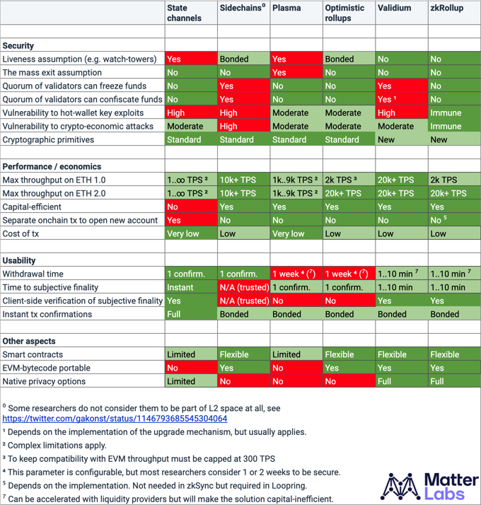

## Layer 2 Scalability?
Layer 2 솔루션 중에서도 Rollup에 대한 검색을 해보면 아래의 표를 접하게 된다.



여기서 주로 볼 항목은 `Performance / ecnomocis` 의 `Max throughput on ETH 1.0` 이다. 아직 실질적인 Eth2.0은 조금 먼 미래이므로, ETH1.0에 해당하는 내용을 살펴보려 한다.

## Gas
### Why Gas Fees Exist
TPS에 대한 계산 과정을 알려면, 이더리움 계열 블록체인의 Gas 개념을 알고 있어야 한다.

Gas라는 이름에서부터 느껴지듯이, 이는 이더리움 네트워크의 Fuel (연료) 로 사용된다.
EVM (Ethereum Virtual Machine) 상에서 동작하는 연산 과정의 양을 나타내는 유닛 단위이다.

이더리움에 트랜잭션을 제출할 때, 수수료인 Fee를 명시하는데, 이 Fee를 토대로 해당 트랜잭션을 위해 수행되어야 하는 연산의 양을 한정할 수 있다.
무한 루프나 불필요한 연산 과정을 제거하기 위해 Gas 개념이 필요하다.

Gas Price는 ETH로 명시하는데, gwei (giga-wei; 1 gwei = $10^{-9}$ ETH) 단위로 표현한다.


### London Upgrade 이후

2021년 8월에 진행된 [런던 업그레이드](https://ethereum.org/ko/history/#london)에서는 많은 부분에 대한 스펙이 변경되었다.

1. Block Size
   업그레이드 이후 이더리움 블록은 Variable Size를 갖게 된다.
   
   각 블록의 타깃 사이즈는 15 million gas이지만, 상황에 따라 늘어나거나 줄어들 수 있고, 최대 블록 크기는 30 million gas로 제한되어 있다.
   
   새로 등록될 블록의 크기가 타깃보다 크다면, 프로토콜은 뒤에 이어질 블록의 Base Fee를 증가시키며, 타깃보다 작다면 그 반대로 동작한다. 이렇게 상대적으로 동작하며, 평균으로는 15 million gas에 도달하게 된다.
2. Base Fee
   트랜잭션이 블록에 담기기 위해서는 최소한 제안된 Gas Price가 Base Fee보다는 크거나 같아야 한다. 그리고 트랜잭션이 승인되면 제출된 Base Fee는 소각된다.
   
   Base Fee는 이전 블록과 타깃 사이즈 간의 크기 비교를 통해 구해진다. 만약 타깃 블록 사이즈보다 크다면 Base Fee는 최대 12.5% 만큼 증가하게 된다.
   
   | Block Number | Included Gas Fee | Increase | Current Base Fee |
   | ------------ | ---------------- | -------- | ---------------- |
   | 1            | 15M              | 0%       | 100 gwei         |
   | 2            | 30M              | 0%       | 100 gwei         |
   | 3            | 30M              | 12.5%    | 112.5 gwei       |
   | 4            | 30M              | 12.5%    | 126.6 gwei       |
   | 5            | 30M              | 12.5%    | 142.4 gwei       |
   
3. Priority Fee (Tips)
   Base Fee는 소각되는 것에 반해, Priority Fee는 블록 제안자에게 인센티브를 주기 위해 제공된다.
4. Max Fee
   유저가 제출한 트랜잭션이 네트워크에서 동작할 때 소진될 Fee를 제한할 수 있다. 당연하게도 Max Fee는 Base Fee와 Priority Fee의 합보다 커야한다. Actual Fee가 Max Fee보다 작을 경우, 차이에 해당하는 만큼은 환불된다.
   
   스탠다드 ETH 전송 트랜잭션은 21,000 units 만큼의 Gas Limit이 요구된다.

예를 들어, 만약 Alice가 Bob에게 1 ETH를 전송하려는 경우에서 Gas Limit은 21,000 units, Base Fee는 10 gwei, Tip은 2 gwei로 설정한다면, 아래처럼 Fee가 계산된다.
$$
21,000 * (10 + 2) = 252,000 \ gwei = 0.000252 \ ETH
$$
지불된 `0.000252 ETH`에서 네트워크 검증자에게는 팁으로 `0.000042 ETH`가 주어지고, Base Fee `0.00021 ETH`는 소각된다.

더불어 각 트랜잭션마다 Max Fee를 설정할 수 있다. Max Fee와 Actual Fee 차이 만큼은 환불된다. (i.e. $refund = max \ fee - (base \ fee + priority \ fee)$)

### Why Gas Fees Get So High
EVM 상의 모든 동작은 Gas 소모하게끔 설계되어있고, 각 블록당 Gas Space는 제한되어 있다. 단순 연산, 데이터 보관 및 변경, 토큰 전송 등 동작의 종류에 따라 소모되는 Gas의 양이 달라진다.

DApp의 복잡성이 증가할수록, 소모되는 Gas 양이 자연스레 증가할 수 있고,
아니면 네트워크가 혼잡한 경우 자신의 트랜잭션이 먼저 승인되기 위해 더 높은 Tip을 설정하여 Gas Fee가 커질 수 있다.

같은 동작을 수행하더라도, 즉 동일한 Gas를 소비하더라도 Gas Fee에 따라 트랜잭션 Fee가 달라지게 된다. [예제 트랜잭션](https://etherscan.io/tx/0x7a1a7deb40a205e0e56f1434889fe7c1f293a1cea8f677f119e13e0b3a4ab836)으로 살펴보자면,
- Gas
	- Limit: 328,824
	- Usage: 271,842
- Gas Fee
	- Base: 16.722 Gwei
	- Max Priority: 0.384 Gwei
	- Max: 38.797 Gwei
- Gas Price: 17.106 Gwei
- Transaction Fee: 0.004025114155490036 ETH
$$
\begin{matrix}
GasPrice = BaseGasFee + MaxPriorityGasFee \\
TransactionFee = GasPrice \ * \ GasUsed
\end{matrix}
$$

## Data Location
Gas 개념을 알았다면 이 Gas가 어떨 때 사용되는 지도 알아야 한다.
EVM 상에서 동작하는 코드들은 다른 VM을 사용하는 언어와 유사하게 리소스가 필요하다.

먼저 솔리디티에는 Reference Type 변수가 있는데, 이 변수들은 솔리디티 코드 작성 시에 해당 데이터가 저장되는 위치를 명시해야 한다. 그렇지 않으면 컴파일 에러를 내뱉는다.

대략적으로 Reference Type에는 Array, Structs 등이 있다.
선택 가능한 옵션은 아래와 같이 세 가지 있다.

### Storage
먼저, Storage는 Persistent 성질의 공간을 의미한다. 모든 상태 변수들은 Storage에 저장되며, 실제로 블록체인에 저장되는 데이터들이 모두 이곳에 해당한다.
Stoarge에 데이터를 저장하는 작업은 매우 큰 Gas를 소비하는 것 중 하나이다.

EVM에서 Storage 공간에 접근하기 위해 사용되는 OPCode는 다음과 같다.
- `SLOAD`
  하나의 Word를 Storage에서 VM Stack으로 로드한다.
- `SSTORE`
  하나의 Word를 Storage에 저장한다.

```solidity
contract Storage {
    uint256 public number;
    address public account;
    uint256[] private array;
    mapping(uint256 => uint256) private map;

    function Storage() public {
        number = 2;
        account = this;
        array.push(10);
        array.push(100);
        map[1] = 9;
        map[2] = 10;
    }
}
```

### Memory
메모리는 External Function Call 시에만 존재하는 휘발성 데이터가 위치하는 곳을 의미한다.
주로 Internal Function 호출을 위해 Arguments를 전달할 때 이용된다.

EVM에서 Memory 공간에 접근하기 위해 사용되는 OPCode는 다음과 같다.
- `MLOAD`
  하나의 Word를 Memory에서 VM Stack으로 로드한다.
- `MSTORE`
  하나의 Word를 Memory에 저장한다.
- `MSTORE8`
  하나의 Byte를 Memory에 저장한다.

### Calldata
Call에 쓰이는 Data. 즉, 함수 호출시 인자 혹은 Input으로 포함된 데이터들이 위치하는 공간을 의미한다.

EVM에서 이 공간에 접근할 때 사용되는 OPCode는 다음과 같다.
- `CALLDATASIZE`
  트랜잭션 Input Data의 크기를 가져온다.
- `CALLDATALOAD`
  트랜잭션 Input Data에서 32 bytes 만큼 가져온다.
- `CALLDATACOPY`
  트랜잭션 Input Data를 읽어서 Memory로 복사해 온다.

```solidity
contract Calldata {
    function add(uint256 _a, uint256 _b) public view
    returns(uint256 result) {
        assembly {
            let a: = mload(0x40)
            let b: = add(a, 32)
            calldatacopy(a, 4, 32)
            calldatacopy(b, add(4, 32), 32)
            result: = add(mload(a), mload(b))
        }
    }
}
```

### Memory vs. Calldata

```solidity
contract DataLocations {
	function set(address _addr, string calldata _text) external {
		...
	}
}
```

`set()`에서 `_text`가 `calldata`로 명시되어 있다.
이 의미는 "`_text` 라는 Reference Type 인자를 `calldata` 영역에 위치해두고 쓰겠다"라는 것이다.
만약 `calldata`가 아닌 `memory` 키워드를 사용했다면, 함수의 인자로 전달된 `calldata`에서 새롭게 Memory로 데이터를 복사하여 사용하게 된다.

솔리디티에서 함수 인자로 전달된 모든 데이터는 트랜잭션의 Data 필드에 포함된다.
Data 필드는 Function Identifier, Argument 등 함수 호출에 필요한 데이터들이 포함되기 때문에 Input Data, 또는 Calldata 등으로 혼용해서 칭한다.

즉, 위 코드에서 `calldata`로 표기하게 되면 그래도 Calldata에 포함된 데이터를 사용하겠다는 의미이고, `memory`로 표기하게 되면 Calldata로부터 데이터를 가져와 별도의 카피본을 만들어서 사용하겠다는 의미다.

당연하게도 이런 경우 `memory`를 사용하면 더 많은 Gas가 필요하게 된다.

## Optimistic Rollup

### How Fees Work
Optimistic Rollup은 Ethereum처럼 Gas Fee 스키마를 채택했다. 트랜잭션 Fee는 동작하는 작업에 따라 달라지게 된다.
1. L2에서 발생한 트랜잭션 데이터와 블록 헤더 (Prev. 블록 헤더 Hash, State Root, Batch Root) 를 L1인 이더리움 Calldata에 제출한다.
   [EIP-1559](https://eips.ethereum.org/EIPS/eip-1559)에 의해 일부 동작에 따른 Gas 정도가 달라졌는데, Calldata에 1 바이트 Non-Zero 기록하는 것은 16 Gas를 소모하고 1 바이트 Zero 기록하는 것은 4 Gas를 소모한다.
   따라서 롤업할 때의 압축하는 등의 과정을 거쳐 데이터 크기를 물리적으로 줄이는 것에 따라 Gas Fee가 달라질 수 있다.
2. L2를 운영하는 노드들에게 일종의 보상으로 증여되는 수수료가 존재할 수 있다.

### How Scale Ethereum
Optimistic Rollup은 L2에서 수행된 트랜잭션들을 배치로 모은 후 압축하여 L1에 제출한다.
여기서 확장성에 영향을 미치는 요소가 두 가지가 있다.
- 배치의 주기
  Trade-Off 요소다.
  배치 주기를 길게 하면 더 많은 L2 트랜잭션들을 하나의 L1 트랜잭션에 담을 수 있지만, 그만큼 L2 유저들은 최종 Finality가 될 때까지 더 오랜 시간동안 기다려야 한다.
  반대로 주기를 짧게 하면 빠르게 Finality가 확정되지만, 그만큼 자주 L1에 트랜잭션을 제출해야 하기 때문에 Fee가 증가한다.
- 압축의 정도
  L1 트랜잭션에 담기는 데이터의 양을 줄여야 한다.
  위에서 설명했듯이 Calldata에 1 바이트 쓰는데 16 Gas가 소모되기 때문에 바이트 크기를 줄이는 게 핵심이다.
  혹은 불필요한 필드를 제거하는 방향 또한 고려될 수 있다.

[비탈릭 부테린 블로그 포스팅](https://vitalik.ca/general/2021/01/05/rollup.html)에서는 가장 단순한 ETH 전송 트랜잭션이 아래와 같이 압축될 수 있다고 적혀있다.

| Parameter | Ethereum | Rollup |
| --------- | -------- | ------ |
| Nonce     | ~3       | 0      |
| Gas Price | ~8       | 0~0.5  |
| Gas       | 3        | 0~0.5  |
| To        | 21       | 4      |
| Value     | ~9       | 4      |
| Signature | ~68      | ~0.5   |
| From      | 0        | 4      |
| Total     | ~112     | ~12    |

포스팅에 각 파라미터별 어떻게 이정도의 압축 (실질적으로는 롤업 불필요한 필드는 제거하는 느낌) 이 이론적으로 가능한 이유가 적혀있다.

결과적으로 하나의 L2 트랜잭션은 12 bytes로 압축될 수 있다. 이를 토대로 확정성을 계산해보면 아래와 같다.
1. 이더리움 (L1) 블록은 평균적으로 15m Gas 를 담는다.
   Calldata 1 bytes 기록하는데 16 Gas가 소모되므로, L1 블록에 담을 수 있는 데이터의 크기는 937,500 bytes ($15,000,000/16$) 이다.
2. 가장 기본적인 L2 트랜잭션이 12 bytes로 압축된다면, L1 블록에는 78,125 개 ($937,500/12$) 의 L2 트랜잭션이 담길 수 있다.
3. L1 블록 하나가 만들어지는데 대략적으로 [13초](https://etherscan.io/chart/blocktime) 걸린다고 한다면, 6009 TPS ($78,125/13$) 가 가능하다.
4. 다만 이 계산은 L1 블록에 담기는 모든 트랜잭션이 L2 롤업에 쓰인다고 가정한 경우이므로, 현실적으로 어렵고 $1/3$를 차지한다면 약 2000 TPS가 가능하다.

가장 처음에 봤던 표에 적혀있듯이 Optimistic Rollup은 위의 계산으로 2k+ TPS가 가능하다. 다만 표에서 각주로 아래와 같이 써있다.
> To keep compatibility with EVM throughput must be capped at 300 TPS

그렇다면 실제 구현 프로젝트인 Optimism에서는 어떨까?

먼저 Optimism은 L2 트랜잭션들을 L1 트랜잭션의 Calldata에 담을 때 `zlib` 알고리즘으로 압축하여 기록한다. 자세한 내용은 [공식 Medium 포스팅](https://medium.com/ethereum-optimism/the-road-to-sub-dollar-transactions-part-2-compression-edition-6bb2890e3e92) 에서 확인할 수 있다.

[L2 트랜잭션](https://optimistic.etherscan.io/tx/0x2f2ed440c673c03adea2b41034bd1539c7f743548e4adc60de4d5119a137046e) 과 이 트랜잭션을 담은 [L1 트랜잭션](https://etherscan.io/tx/0x4458bf9c23193e7ef35c45fc59ac8f92947a309239d0071067b3778ea380ec97) 을 예시로 살펴보자. (이 L2 트랜잭션은 단순 ETH 전송 트랜잭션이다.)
실제 L1에 담긴 트랜잭션 트랜잭션 크기는 대략적으로 110 bytes 정도이고 12 bytes와는 크게 벗어나는 크기임을 알 수 있다.
그리고 이 L1 트랜잭션에 담긴 L2 트랜잭션들의 평균 크기는 압축 전 433 bytes, 압축 후 152 bytes이다. (평균 값은 블록마다 천차만별일 수 있다.)

이렇게 각 트랜잭션 크기가 이론적인 12 bytes보다 훨씬 큰 이유는 EVM Compatibility 때문이다. 이러한 경우로 다시 확장성을 계산해보면 아래와 같다.
1. L1 블록에 담을 수 있는 데이터 크기는 937,500 bytes로 동일하다.
2. ETH 전송하는 L2 트랜잭션 크기를 110 bytes로 볼 때, L1 블록에는 8,522 개 ($937,500/110$) 의 L2 트랜잭션이 담길 수 있다.
3. L1 블록 생성 주기를 13초로 동일하게 보면, 655 TPS ($8522/13$) 가 가능하다.
4. L1 블록의 $1/3$ 만 롤업에 쓰인다면, 218 TPS 가 가능하다.

더 나아가서 단순 ETH 전송 트랜잭션이 아닌 복합적인 것으로 계산해보자면, 즉 위의 평균 L2 트랜잭션 크기로 계산해보면, 158 TPS 가 가능하다.

이 수치는 [지난 1달간 평균 이더리움 TPS인 12.74](https://ethtps.info/)와 비교해보면 대략 10x 정도의 확장성 개선이 가능한 셈이다.

## ZK Rollup


## Reference
- [Alex Gluchowski, "# Evaluating Ethereum L2 Scaling Solutions: A Comparison Framework"](https://blog.matter-labs.io/evaluating-ethereum-l2-scaling-solutions-a-comparison-framework-b6b2f410f955)
- [Ethereum Official Docs - Gas](https://ethereum.org/ko/developers/docs/gas/)
- [Aiden Park, "<Solidity 씨-리즈> 은근 헷갈리는 Data Location"](https://medium.com/@aiden.p/solidity-%EC%94%A8-%EB%A6%AC%EC%A6%88-%EC%9D%80%EA%B7%BC-%ED%97%B7%EA%B0%88%EB%A6%AC%EB%8A%94-data-location-2690cefb72db)
- [OpenZeppelin, "Ethereum in Depth, Part 2"](https://blog.openzeppelin.com/ethereum-in-depth-part-2-6339cf6bddb9/)
- [Ethereum Official Docs - Optimistic Rollup](https://ethereum.org/ko/developers/docs/scaling/optimistic-rollups/)
- [Vitalik Buterin, "An Incomplete Guide to Rollups"](https://vitalik.ca/general/2021/01/05/rollup.html)
