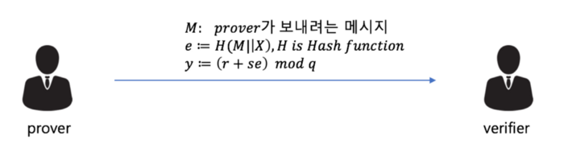
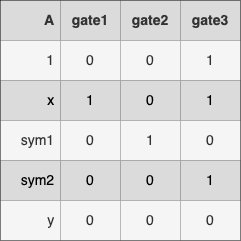
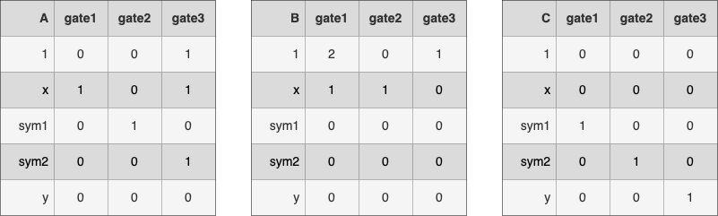
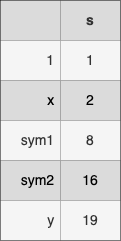
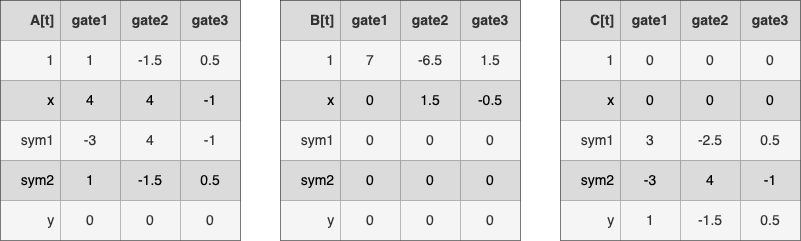
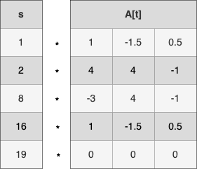
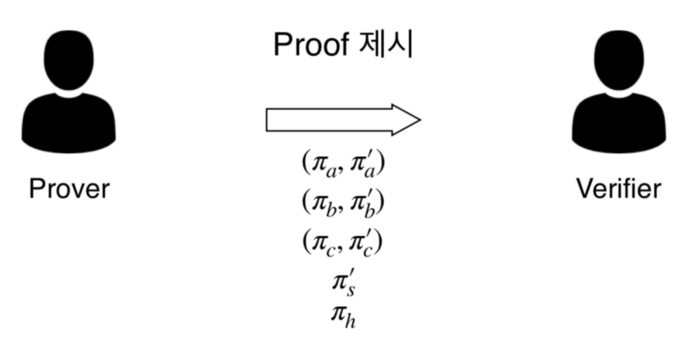
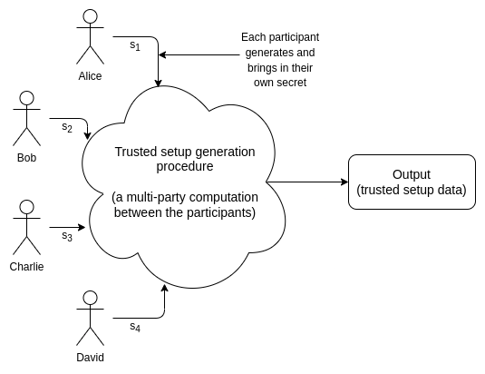
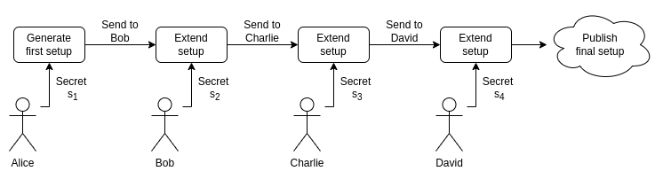
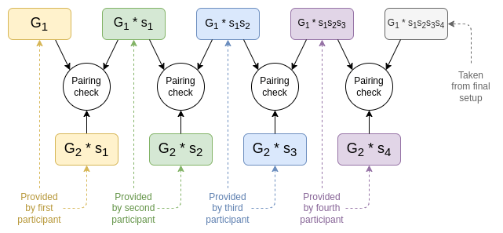

## Point: Non-Interactive

이전 포스팅에서 알아 보았듯이, 블록체인의 특성을 고려할 때 영지식 증명 중에서도 비대화형 시스템 (NIZKP; Non-Interactive Zero-Knowledge Proof) 이 적합하다. NIZKP의 핵심은 결국 Prover와 Verifier의 메시지 교환이 **최소화**되어야 한다는 것을 의미한다. 즉, Prover가 특정 메시지를 Verifier에게 보내고 난 다음, 차후의 작업을 처리할 때 추가로 메시지가 필요하다면 이는 Non-Interactive 방식이 아니다. Prover가 증명에 필요한 메시지를 보내고 난 후 연결이 끊어진다고 하더라도 결국에는 그 메시지가 검증되어야 하는 것이 NIZKP의 핵심이다.

### Schnorr Identification Protocol

암호학에서 Schnorr Protocol은 Prover가 자신의 Private Key를 공개하지 않고 이를 소유하고 있음을 증명할 수 있는 방법이다. 키 교환 프로토콜이기 때문에 실제 블록체인에 적용될 수 있는 NIZKP 개념과 유사하다.

먼저 Prover만 알고 있는 변수와, Prover 및 Verifier가 공유하는 변수들은 다음과 같다. 각 변수의 값을 선택 혹은 도출하는 방식은 아래를 참고하길 바란다.

- Global Variables
  - $p: \ prime \ num$
  - $q: \ (p-1) \ factor \ (인수)$
  - $a: \ a^{q} \equiv 1 \ (mod \ p)$
  - $v: \ public \ key \ (v=a^{-s} \ mod \ p)$
- Prover's Side
  - $s: \ private \ key \ (0<s<q)$
  - $r: \ random \ num$
  - $X=a^{r} \ mod \ p$

여기서 Prover는 $s$의 값을 Verifier에게 공개하지 않고, 자신이 $s$를 알고 있다는 것을 납득시키려 한다.

1. Prover는 Random Value $r \ (0<r<q)$을 하나 선택하여 그에 따른 $X$ 값을 계산한다.
2. Prover가 보내고자 하는 메시지 $M$ 과 $X$ 값을 이어 붙인 후, 이를 해시하여 새러운 서명 $e$ 를 만든다.
3. 만든 서명 $e$ 를 토대로, 또 다른 서명 $y$ 값을 도출해낸다.
4. Prover는 메시지 $M$ 과 도출해낸 서명 $e, \ y$ 를 Verifier에게 보낸다.

Verifier는 Prover로 부터 받은 정보를 통해 수행해야 하는 것은, $M, \ e, \ y$ 를 통해 계산해낸 $X'$ 와 Prover가 가지고 있는 $X$ 와 일치하는 지를 확인하는 것이다. 하지만 $X$ 는 Prover만 알고 있는 정보이기 때문에, 다음과 같은 과정을 통해 $X'$ 를 도출해낸다.
$$
\begin{matrix}
\begin{cases}
X=a^{r} \ mod \ p \\
r=y-s * e \\
\end{cases} \\
\Downarrow \\
\begin{cases}
X' = a^{y-se} \ mod \ p = a^{y}*a^{-se} \ mod \ p \\
v = a^{-s} \ mod \ p \\
\end{cases} \\
\Downarrow \\
X'=a^{y}*v^{e} \ mod \ p
\end{matrix}
$$
위와 같은 과정에 따라 $X=X'$ 임을 확인할 수 있다. 하지만 Verifier가 $X'$ 값을 도출하였어도, 실제 $X$ 값을 Prover로 부터 전달받지 못하기 때문에 직접 확인할 수 없다. 그래서 Verifier는 도출한 $X'$ 를 이용하여 $e'$ 값을 계산한다.
$$
e'=H(M \parallel X')
$$
실제로 $X=X'$ 가 만족한다면, $e=e'$ 가 되어 Verifier는 납득할 수 있고, 결국 Verifier는 Private Key $s$ 값이 무엇인 지는 모르지만  Prover가 이를 알고 있다는 사실을 수학적으로 납득할 수 있게 된다.

## More Succinct

zk-SNARKs는 Zero-Knowledge Succinct Non-Interactive Argument of Knowledges의 줄임말로, 기존의 NIZKP에서 Succinctness (간결함) 이 추가된 개념이다.

기존 NIZKP는 Prover가 항상 온라인 상태일 필요가 없다는 장점이 있지만, 증명을 완료하는데 상당한 시간이 걸릴 수 있는 단점이 있다. 위에서 언급한 Schnorr 프로토콜에서도, Verifier가 $X'$ 값을 계산하기 위해서는 $a^{r} \ mod \ p$ 연산을 수행해야 한다. 암호학에서는 $a, \  r, \ p$  값들이 매우 크기 때문에 상당한 시간이 소요된다.

zk-SNARKs에서 중요한 특성이 바로 간결함이다. Prover가 특정 정보를 알고 있다는 증거로 제출한 Proof가 엄청난 크기의 데이터라면, 이에 대한 증명은 굉장히 비효율적일 것이다. 이에 zk-SNARKs에서는 NIZKP의 Proof 크기를 줄여 빠른 시간 내에 검증을 수행할 수 있도록 하여 실용성을 극대화하였다.

## Dive into zk-SNARKs

$$
\begin{matrix}
Existing \ Problem \\
\Downarrow \\
R1CS \\
\Downarrow \\
QAP \\
\Downarrow \\
Elliptic \ Curve \ Pairing \\
\Downarrow \\
ZKP
\end{matrix}
$$

zk-SNARKs는 간결한 증명을 위해 R1CS (Rank 1 Constraint System) 과 QAP (Quadratic Assignment Problem) 을 이용해 문제를 변환했으며, 영지식성을 위해 타원 곡선 페어링 (Elliptic Curve Pairing) 을 이용했다.

### Existing Problem

- Public 정보
  
  $f(x): \ y=x^{3}+2x^{2}+x+1, \ y=19$

- Prover 목적
  
  위 식의 해 ($x=2$) 를 밝히지 않으면서 알고 있음을 증명

### R1CS

먼저 주어진 방정식을 연산이 용이한 형태인 R1CS (Rank 1 Constraint System) 형태로 변환한다. 이를 위해 방정식을 단계적 곱 연산으로 펼친다.

- Gate 1: $x*(x+2) = sym1$
- Gate 2: $sym1 \ * \ x = sym2$
- Gate 3: $(sym2+x+1)*1=y$

Gate 1 ~ 3 까지의 연산을 수행하면 원래의 식 $y=x^3+2x^2+x+1$ 이 구해진다. 각각의 Gate들은 곱 연산으로 펼쳐져 $A*B=C$ 형태를 띄고 있고, 중간 산출물 $sym1, \ sym2$ 를 포함한 5가지 수 ($1, \ x, \ sym1, \ sym2, \ y$) 로 이루어져 있다.

A 항은 각 Gate에서 $x, \ sym1, \ sym2+x+1$ 이고, 이를 $[1, \ x, \ sym1, \ sym2, \ y]$ 형태로 나타내내면 아래와 같다.

마찬가지의 방법으로 B, C 항을 다음과 같이 나타낼 수 있다.

이는 주어진 방정식 형태를 변환시킨 것으로, 방정식과 주어진 행렬들은 완벽한 동치이다. 해당 행렬들은 각 Gate에서 사용된 변수들의 계수 정보를 나타내는 행렬이다. ($1$ 은 상수이지만 편의상 변수라고 하겠다)

Prover가 알고 있는 Private 정보인 방정식의 해 ($x=2$) 또한 변환한다. 각 Gate에 $x=2$ 를 대입 했을 때 다섯 개의 변수들은 각기 고유한 값을 가진다. 따라서 $x=2$ 는 다음과 같이 변환되며, $x=2$ 와 동치인 위 벡터를 $s$ 라고 지칭하자.

### QAP

R1CS 형태로 변환된 방정식을 QAP (Quadratic Assignment Problem) 형태로 다시 한 번 변화시킨다. 이는 두 가지 목적을 위함이다.

1. 문제의 변형
2. 검증의 간결함 부여

#### 문제의 변형

A 행렬의 $x$ 항 ($[1, \ 0, \ 1]$) 을 살펴보자. 이것이 의미하는 바를 풀어쓰면 아래와 같다.

- Gate 1에서 $x$ 는 $1$ 이라는 계수를 가진다. $\Rightarrow (1, \ 1)$
- Gate 2에서 $x$ 는 $0$ 이라는 계수를 가진다. $\Rightarrow (2, \ 0)$
- Gate 3에서 $x$ 는 $1$ 이라는 계수를 가진다. $\Rightarrow (3, \ 1)$

위 정보로 얻은 세 개의 점을 부드럽게 잇는 함수 (이 경우, 2차 함수) 로 나타내면, $f(t)=t^2-4t+4$ 이다. 이 다항함수 각 항의 계수를 따와 $[4, \ -4, \ 1]$ 로 나타내보자. 이와 같은 방법으로 A, B, C 항 모두 적용하면, 행렬이 아래와 같은 다항함수 벡터로 변형된다.

각 다항함수는 각 게이트에서의 계수 정보를 지닌 점을 지나는 함수이다. 예를 들어 Gate 1 ($t=1$)  일 때 A 항의 $x$ 계수는 $4-4*1+1*1^2$ 이므로 $1$ 이다. Gate 1 ($t=1$) 일 때 A 항의 $1$ 계수는 $1-1.5*1+0.5*1^2$ 이므로 $0$ 이다. 따라서 당연히 세 다항식 벡터 $A[t], \ B[t], \ C[t]$ 는 각 게이트 ($t=1$,  $t=2$, $t=3$) 에서 각각 A, B, C 항의 계수를 반환한다. 마찬가지로, 세 다항식 벡터는 원래의 방정식 $y=x^3+2x^2+x+1$ 와 동치이다.

이렇게 원래의 방정식을 세 다항식 벡터로 변환시켰다. 어떻게 문제가 변형되었는 지 직접 확인해 보자.

Prover만이 알고 있는 벡터 $s$ 와 세 다항식 벡터 중 $A[t]$ 를 함께 살펴보도록 하자. 우선 $s$ 와 $A[t]$ 를 곱 (내적) 했을 때의 의미를 알아보자.
$$
s \ \cdot \ A[t] = A(t)
$$

$s \ \cdot \ A[t]$ ($s$ 와 $A[t]$ 의 내적) 은 $s$ 의 인자와 그에 대응하는 $A[t]$ 의 다항식을 곱하고, 그것들을 모두 더하여 계산한다. 예를 들어 $t=1$ 인 경우, $1*1+2*4+8*(-3)+16*1+19*0$ 이므로 $1$ 이 된다. 이렇게 계산하면, 내적 연산의 결과값인 $A(t)$ 는 $[1, \ -1.5, \ 2.5]$ 가 된다.

그렇다면 $A(t)$ 가 의미하는 바는 무엇일까? A 항은 Gate 1에서 $x$, Gate 2에서 $sym1$, Gate 3에서 $sym2+x+1$ 이었으며, 벡터 $s$ 값을 대입하면 각각 $2, \ 8, \ 19$ 가 된다. 이는 $A(t)$ 가 $t=1$,  $t=2$, $t=3$ 일 때의 값과 각각 일치한다.

이를 통해 $A(t)$ 는 각 Gate에서 A 항의 실제 값이란 것을 알 수 있다. 마찬가지로 $B(t), \ C(t)$ 도 각  Gate에서 B, C 항의 실제 값이 된다. 이때 각 Gate에서 A, B, C는 $A*B=C$ 라는 등식을 만족하므로, $A(t)*B(t)-C(t)=0$ 라는 다항식은 $t=1, \ 2, \ 3$ 에서 $0$ 값을 반환할 것이다. 따라서 이 다항식은 $(t-1)(t-2)(t-3)$ 으로 나누어 떨어지게 된다. 이를 정리하면 아래와 같다.
$$
\begin{matrix}
A(t)*B(t)-C(t)=H(t)*Z(t) \\
\\
A(t)=[1, \ -1.5, \ 2.5] \\
B(t)=[7, \ -3.5, \ 0.5] \\
C(t)=[-5, \ 15.5, \ -2.5] \\
H(t)=[-2, \ 1.25] \\
Z(t)=(t-1)(t-2)(t-3)
\end{matrix}
$$
즉 문제는 이제,

"$y=x^3+2x^2+x+1, \ y=19$ 의 해가 $x=2$ 인가?" 에서
"세 다항식 벡터 $A[t], \ B[t], \ C[t]$ 가 주어졌을 때, $Z(t)$ 로 나누어 떨어지도록 하는 $A(t), \ B(t), \ C(t)$ 를 만드는 벡터가 $s=[1, \ 2, \ 8, \ 16, \ 19]$ 인가?"

로 변형되었다.

변형된 문제에서 주어진 $A[t], \ B[t], \ C[t], \ Z(t)$ 로 부터, 식 $A(t)*B(t)-C(t)=H(t)*Z(t)$ 를 만족하는 $A(t), \ B(t), \  C(t), \ H(t)$ 는 벡터 $s$ 를 알아야만 제시할 수 있다.

#### 검증의 간결함 부여

이제 간결함을 더하기 위해, 특정 점 $t_0$ 을 잡는다. 주어진 식에서 양측 다항식이 같음을 증명하는 것 보다 어떤 특정 점에서 증명을 하는 것이 훨씬 간결하다. 이는 이론적으로 무한한 실수 범위에서 서로 다른 두 다항식의 교차점은 유한하므로 우연히 겹칠 확률은 0이기에, 어느 랜덤한 한 점에서 증명하더라도 두 다항식이 같음을 납득할 수 있다. 앞의 R1CS를 실수범위의 QAP로 확장시킨 이유가 바로 간결한 증명을 위한 임의의 점을 택하기 위함이다.

그렇다면 주어진 값은 이제 $A[t], \ A[t_0], \ B[t], \ B[t_0], \ C[t], C[t_0], \ Z(t), \ Z(t_0)$ 이다. 이들로 부터 Prover는 $A(t_0)*B(t_0)-C(t_0)=H(t_0)*Z(t_0)$ 을 만족하는 $A(t_0), \ B(t_0), \  C(t_0), \ H(t_0)$ 를 제시해야 한다.

Verifier는 아래의 두 가지를 검사한다.

1. 제시된 $A(t_0), \ B(t_0), \  C(t_0), \ H(t_0)$ 가 식을 만족하는 지 검증한다.
2. 제시된 $A(t_0), \ B(t_0), \  C(t_0), \ H(t_0)$ 가 각각 $A[t_0], \ B[t_0], \ C[t_0]$ 로 부터 동일한 벡터 $s$ 에 대해 나온 값임을 검증한다.

이 과정에서 점 $t_0$ 은 **Trusted Party**에 의해 생성 및 공개된다. 이 부분은 zk-SNARKs의 한계로 지적되는 점이기도 하다.

### Elliptic Curve Pairing

주어진 문제를 변형하고 간결함을 더했지만 아직 정보를 숨기는 것, 즉 Zero-Knowledge를 더하지 못했다. 이를 위해  zk-SNARKs에서 이용한 알고리즘이 Elliptic Curve (타원 곡선) 암호화 방식이다.

이로 인해 일반적인 계산을 타원 곡선 세계 위로 가져온다고 할 수 있다. 즉, 증명하고자 하는 $A(t_0)*B(t_0)-C(t_0)=H(t_0)*Z(t_0)$ 등식을 타원 곡선 위에서 증명하고자 한다. 타원 곡선의 세상에서는 정보를 숨기고 등식만 증명하는 것이 가능하기 때문이다. 이를 위해 짚고 넘어가야 할 타원 곡선의 특징은 다음과 같다.

1. 상수 $p$ 에 대하여 $P=p \ * \ G$ 를 만족하는 타원 곡선 위의 점 P를 알고 있을 때, 점 P로 부터 상수 $p$ 를 도출해낼 수 없다. (점 G는 알려진 타원 곡선 위의 점)
2. $P=k \ * \ Q$ 에서 $k$ 를 알지 못한다면, $R=k \ * \ S$ 인 $(R, \ S)$ 를 도출하는 방법은 $\begin{cases} R=c \ * \ P \\ S=c \ * \ Q \end{cases} \ (c는 임의의 상수)$ 와 같이 $(P, \ Q)$ 에서 도출하는 방법 뿐이다.
3. $e(P, \ Q)$ 는 타원 곡선에서 곱셈과 같은 역할을 한다. 특히, $e(P, \ S)=E(R, \ Q) \Leftrightarrow \exists \ k \ s.t. \ \begin{cases} P \ * \ k = Q \\ R \ * \ k = S \end{cases}$

이 세 가지 특징을 이용하여 증명하고자 하는 문제를 다시 한 번 변형해보자. 공개된 타원 곡선 위의 한 점 G를 이용해 원래의 증명식 $A(t_0)*B(t_0)-C(t_0)=H(t_0)*Z(t_0)$ 의 각 항을 타원 곡선 위의 점으로 변환하면 아래와 같다.
$$
\begin{matrix}
\pi_a = A(t_0) \ * \ G \\
\pi_b = B(t_0) \ * \ G \\
\ldots
\end{matrix}
$$

이를 이용해 증명식을 표현하면 아래와 같다.
$$
\begin{matrix}
A(t_0)*B(t_0)-C(t_0)=H(t_0)*Z(t_0) \\
\Downarrow \\
\frac{\pi_a}{G} * \frac{\pi_b}{G} - \frac{\pi_c}{G} = \frac{\pi_h}{G} * Z(t_0) \\
\Downarrow \\
\frac{e(\pi_a, \ \pi_b)}{e(\pi_c, \ G)} = e(\pi_h, \ Z(t_0) \ * \ G) \\
(G, Z(t_0) \ * \ G 는 공개되어 있다.)
\end{matrix}
$$

- Prover가  $\pi_a, \ \pi_b, \ \ldots$ 를 Verifier에게 전달하더라도, 타원 곡선의 첫번째 특징으로 인해 Verifier는 $A(t_0), \ B(t_0), \ \ldots$ 를 도출할 수 없다.

그리고 Trusted Party가 공개한 벡터인 $A[t_0], \ B[t_0], \ \ldots$ 들은 아래와 같이 타원 곡선 위로 대응시킨 점들의 벡터로 변형된다.
$$
A[t_0] \ * \ G \ = \ \begin{matrix} [A1(t_0)] \\ [A2(t_0)] \\ [A3(t_0)] \\ \ldots \end{matrix} \ * \ G = \ \begin{matrix} [\pi_{a1}] \\ [\pi_{a2}] \\ [\pi_{a3}] \\ \ldots \end{matrix}
$$
Prover가 변형된 식을 증명하기 위해 공개된 정보를 이용해 다음의 세 가지 사항을 보여야 한다.

1. 위의 식 ($\frac{e(\pi_a, \ \pi_b)}{e(\pi_c, \ G)} = e(\pi_h, \ Z(t_0) \ * \ G)$) 을 만족하는 $\pi_a, \ \pi_b, \ \pi_c, \ \pi_h$ 를 제시
2. 제시한 점 ($\pi_a, \ \pi_b, \ \pi_c, \ \pi_h$) 들이 Trusted Party가 공개한 정보 ($A[t_0]*G, \ B[t_0]*G, \ C[t_0]*G$) 로 부터 도출되었는 지 증명
3. 제시한 점 ($\pi_a, \ \pi_b, \ \pi_c, \ \pi_h$) 들을 도출할 때 사용한 벡터 $s$가 모두 같은 지 증명

#### 1번

제시해야 하는 점 중 $\pi_a, \ \pi_b, \ \pi_c$ 는 공개된 정보 $A[t_0]*G, \ B[t_0]*G, \ C[t_0]*G$ 에 해답 벡터인 $s$ 를 곱하여 계산할 수 있다. (Prover는  $t_0$ 를 모르기 때문에 $s$ 를 사용할 수 밖에 없다.)
$$
\begin{matrix}
\begin{matrix}
\pi_a &=& A(t_0) \ * \ G \\
&=& s \cdot A[t_0] \ * \ G 
\end{matrix}
\qquad
\begin{matrix}
\pi_b &=& B(t_0) \ * \ G \\
&=& s \cdot B[t_0] \ * \ G 
\end{matrix}
\qquad
\begin{matrix}
\pi_c &=& C(t_0) \ * \ G \\
&=& s \cdot C[t_0] \ * \ G 
\end{matrix}
\end{matrix}
$$
$\pi_h$ 의 경우, 조금 다르게 구해야 한다. Prover는 원래의 식 $A(t)*B(t)-C(t)=H(t)*Z(t)$ 을 계산하여 식 $H(t)=[-2, \ 1.25]$ 자체를 알아낼 수 있다. Trusted Party는 증명을 위해 $G, \ G*t_0, \ G*{t_0}^2, \ \ldots$ 를 제공하는데, 이를 이용해 Prover는 $\pi_h$ 를 만들 수 있다.
$$
\begin{matrix}
\begin{matrix}
\pi_h &=& G \ * \ H(t_0) \\
&=& G \ * \ (1.25*t_0-2) \\
&=& (G*t_0) \ * \ 1.25 + G*(-2)
\end{matrix}
\quad (G, \ G*t_0 는 공개되어 있다.)
\end{matrix}
$$

#### 2번

Trusted Setup은 어떠한 임의의 비밀값 $k_a, \ k_b, \ k_c$ 를 생성한 후 아래의 값을 공개한다. ($k_a, \ k_b, \ k_c$ 값들은 공개되지 않는다.)
$$
\begin{matrix}
A[t_0] \ * \ G \ * \ k_a \\
B[t_0] \ * \ G \ * \ k_b \\
C[t_0] \ * \ G \ * \ k_c
\end{matrix}
$$
Prover는 아래의 값을 제시해야 한다.
$$
\begin{matrix}
{\pi_a}' = \pi_a * k_a \\
{\pi_b}' = \pi_b * k_b \\
{\pi_c}' = \pi_c * k_c
\end{matrix}
$$
Prover는  $k_a, \ k_b, \ k_c$ 를 모르지만 Trusted Setup에서 공개한 값과 벡터 $s$ 를 곱하여 위의 값을 만들 수 있다.
$$
\begin{matrix}
{\pi_a}' &=& \pi_a * k_a \\
&=& s \cdot A[t_0] \ * \ G  * k_a \\
&=& s \cdot (A[t_0] \ * \ G  * k_a) \\
\end{matrix}
$$
여기서 타원 곡선의 성질 중 두 번째 것을 이용한다.

> $P=k \ * \ Q$ 에서 $k$ 를 알지 못한다면, $R=k \ * \ S$ 인 $(R, \ S)$ 를 도출하는 방법은 $\begin{cases} R=c \ * \ P \\ S=c \ * \ Q \end{cases} \ (c는 임의의 상수)$ 와 같이 $(P, \ Q)$ 에서 도출하는 방법 뿐이다.

이를 통해 Prover가 $k_a, \ k_b, \ k_c$ 를 알지 못할 때, 공개된 $A[t_0]*G, \ B[t_0]*G, \ C[t_0]*G$ 로 부터 $\pi_a, \ \pi_b, \ \pi_c$ 을 도출하였음을 증명하였다.

#### 3번

Trusted Party는 새로운 값 $b$ 를 생성하여 아래의 값을 공개한다. (이번에도 $b$ 는 공개하지 않는다.)
$$
(A[t_0] + B[t_0] + C[t_0]) \ * \ G \ * \ b
$$
Prover는 기존에 공개했던 $\pi_a, \ \pi_b, \ \pi_c$ 으로 부터, 식 ${\pi_s}' = (\pi_a + \pi_b + \pi_c) \ * \ b$ 를 $b$ 없이 증명해야 한다.
$$
\begin{matrix}
{\pi_s}' &=& (\pi_a + \pi_b + \pi_c) \ * \ b \\
&=& (s \cdot A[t_0] * G \ + \ s \cdot B[t_0] * G \ + \ s \cdot C[t_0] * G) \ * \ b \\
&=& (s \ \cdot \ (A[t_0] + B[t_0] + C[t_0]) \ * \ G) \ * \ b \\
&=& s \ \cdot \ ((A[t_0] + B[t_0] + C[t_0]) \ * \ G \ * \ b)
\end{matrix}
$$
이를 통해 Prover가 $\pi_a, \ \pi_b, \ \pi_c$ 를 도출할 때 사용한 벡터 $s$ 가 모두 같은 지를 증명했다. 만약 다른 벡터를 사용했다면 위의 계산 과정 중 두번째 줄에서 세번째 줄로 넘어갈 때 하나의  $s$ 로 묶이지 않는다.

위의 과정들을 정리하면 아래와 같다.

1. Prover는  $A[t], \ B[t], \ C[t]$ 를 공개한다.
2. Trusted Party는 $t_0, \ k_a, \ k_b, \ k_c, \ b$ 를 정한 후, Prover의 증명을 위해 아래 값들을 공개한다.
   - $\begin{cases} A[t_0]*G \\ B[t_0]*G \\ C[t_0]*G \end{cases}$
   - $\begin{cases} A[t_0] \ * \ G \ * \ k_a \\ B[t_0] \ * \ G \ * \ k_b \\C[t_0] \ * \ G \ * \ k_c \end{cases}$
   - $G, \ G*t_0, \ G*{t_0}^2, \ \ldots$
   - $(A[t_0] + B[t_0] + C[t_0]) \ * \ G \ * \ b$
3. Prover는 식 $A(t)*B(t)-C(t)=H(t)*Z(t)$ 을 만족하는 $\pi_a, \ \pi_b, \ \pi_c, \ \pi_h$ 값과 이들이 Trusted Party가 제시한 정보로 부터 나왔음을 증명하는 ${\pi_a}', \ {\pi_b}', \ {\pi_c}', \ {\pi_s}'$ 값을 제시한다.

이를 통해 Prover가 증명을 위해 제시해야 하는 Proof가 단 8개의 점 ($=288 bytes$) 이며, 이는 문제의 크기와 상관없이 일정함을 알 수 있다. 또한 Verifier 역시 8개의 점들로 간단한 연살을 통해 옳음을 납득할 수 있다. zk-SNARKs의 큰 장점 중 하나가 바로 이 증명의 간결함이다.

## Trusted Setup

두 개의 타원 곡선 점들의 Series에서 시작된다.
$$
\begin{matrix}
[ \ G_1, \ G_1 * s, \ G_1 * s^2, \ ... \ , \ G_1 * s^{n_1-1} \ ] \\
[ \ G_2, \ G_2 * s, \ G_2 * s^2, \ ... \ , \ G_2 * s^{n_2-1} \ ]
\end{matrix}
$$
주로 100명이 넘는 참여자가 참여하여 Setup 과정을 수행한다. 이들 중 단 한 명이라도 자신의 Secret을 외부에 공개하지 않는다면, Setup 과정은 신뢰할 수 있게 된다.

각 참여자는 랜덤 값 `t` 를 골라서 아래처럼 계산하여 다음 참여자에게 넘겨준다.
$$
\begin{matrix}
[ \ G_1, \ G_1 * s * t, \ G_1 * s^2 * t^2, \ ... \ , \ G_1 * s^{n_1-1} * t^{n_1-1} \ ] \\
[ \ G_2, \ G_2 * s * t, \ G_2 * s^2 * t^2, \ ... \ , \ G_2 * s^{n_2-1} * t^{n_2-1} \ ]
\end{matrix}
$$

## Reference

- [Jungwoo Pro, "Zero-Knowledge proof :: chapter 1. Introduction to Zero-Knowledge Proof & zk-SNARKs"](https://medium.com/decipher-media/zero-knowledge-proof-chapter-1-introduction-to-zero-knowledge-proof-zk-snarks-6475f5e9b17b)
- [Jihyeok Choy, "Zero-Knowledge proof :: chapter 2. Deep Dive into zk-SNARKs"](https://medium.com/decipher-media/zero-knowledge-proof-chapter-2-deep-dive-into-zk-snarks-f8b16e1b7b4c)
- [Vitalik Buterin, "Zk-SNARKs: Under the Hood"](https://medium.com/@VitalikButerin/zk-snarks-under-the-hood-b33151a013f6)
- [Vitalik Buterin, "How do trusted setups work?"](https://vitalik.ca/general/2022/03/14/trustedsetup.html)

