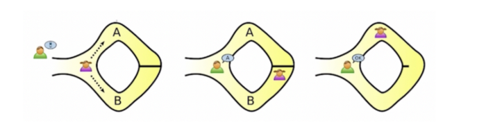

증명할 때 사용되는 여러 방법 중, 특히 영지식 증명에서 주로 사용되는 두 종류의 시스템을 살펴보려 한다.

## Interactive Proof System

### Concept

대화형 증명 시스템은 Prover와 Verifier의 메시지 교환을 통해, Prover 증거가 옳다면 Verfier가 옳다고 판단하고 또는 Prover 증거가 옳지 않다면 Verifier도 옳지 않다고 판단하는 시스템을 의미한다.

대화형 증명 시스템이 되기 위해서는 두 가지 조건을 만족해야 한다.

- Completness (완전성)

  Prover 증거가 옳다면, Verifier는 이를 옳다고 판단해야 한다.

- Soundness (건전성)

  Prover 증거가 옳지 않다면, Verifier는 이를 옳지 않다고 판단해야 한다.

이 둘은 너무나 당연한 것이지만, 여기서의 핵심은 "이 두 가지 조건을 모두 만족하는 시스템을 어떻게 만들 수 있는 가"이다.

### Example

Prover는 두 개의 과일을 갖고 있다. 한 개는 사과이고, 다른 한 개는 바나나이다. Verifier는 Prover가 가지고 있는 과일 2개가 서로 다른 과일인지 확인해보려 한다.

1. Prover는 사과를 1번이라 하고, 바나나를 2번이라 한다. 그리고 1번 사과 이름을 하트라고 하고, 2번 바나나 이름을 별이라고 한다.
2. Verifier는 1번과 2번 중 하나를 랜덤으로 선택하여 Prover에게 메시지를 보낸다. (1번을 선택했다고 가정)
3. Prover는 1번 사과 이름인 하트를 Verifier에게 보낸다.
4. Verifier는 다시 랜덤으로 색을 선택하여 Prover에게 메시지를 보낸다. (2번을 선택했다고 가정)
5. Prover는 2번 바나나 이름인 별을 Verifier에게 보낸다.
6. Verifier는 1번과 2번에 대한 Prover의 답이 하트와 별로 서로 같지 않은 것을 확인하고, Prover가 가진 과일이 다른 종류임을 알 수 있다.

### Characteristic

주목해야 할 특징 중 하나는 Verifier가 보내는 메시지가 랜덤하게 선택된다는 점이다. 만약 과일이 2개가 아니라 100개 이었다면, Verifier는 Prover가 가진 100개의 과일이 서로 다른 지 확인하기 위해 훨씬 더 많은 메시지를 교환해야 한다.

또한 Verifier는 Prover와 메시지를 10번 교환하여 10개의 답이 다르다는 것을 확인할 때 보다, 메시지를 1000번 교환하여 1000개의 답이 다르다는 것을 확인할 때 100개의 과일이 서로 다른 과일임을 더욱 확신할 수 있다. 이는 대화형 증명 시스템 결과의 **안정성이 확률에  의존하며, 이는 대화를 많이 반복할 수록 커진다**는 것을 의미한다. 즉 이 시스템은 완전성의 조건을 100% 만족시킬 수는 없고, 대화를 반복하여 100%에 가깝게 만족시킬 수 있다.

## Interactive Zero-Knowledge Proof System

### Concept

대화형 영지식 증명 시스템은 대화형 증명 시스템의 속성인 완정성과 건전성을 만족하고, 추가로 영지식성을 만족하는 시스템을 말한다. 즉, 대화형 영지식 증명 시스템은 다음 속성을 모두 만족해야 한다.

- Completness (완전성)

  Prover 증거가 옳다면, Verifier는 이를 옳다고 판단해야 한다.

- Soundness (건전성)

  Prover 증거가 옳지 않다면, Verifier는 이를 옳지 않다고 판단해야 한다.

- Zero-Knowledge (영지식성)

  Verifier는 Prover 증거가 옳은지 옳지 않은지의 정보만을 얻을 수 있고, 그 이외에는 어떠한 정보도 얻을 수 없다.

대화형 영지식 증명 시스템은 마찬가지로 결과의 확률을 높이기 위해, 대화를 반복해야 한다.

### Example

Prover는 동굴의 문을 열 수 있는 주문 (`열려라 참깨`) 를 알고 있다. Verifier는 Prover가 주문을 알고 있는지 검증하고 싶으며, Prover는 자신의 주문을 Verifier에게 알리고 싶지 않다. 동굴에는 A와 B 두 방향의 갈래길이 있고, 가운데는 문으로 막혀있다. 동굴의 문은 주문을 통해 열 수 있고, 주문을 알지 못하면 다른 방향으로 나올 수 없다.

1. Verifier는 동굴 밖에서 기다리고, Prover는 A 또는 B 방향의 길 중에서 가고 싶은 곳으로 먼저 들어간다.
2. Verifier는 Prover에게 A (또는 B) 로 나오라고 말한다.
3. Prover는 Verifier가 요구한 방향으로 나온다.
4. 위 과정을 반복한다.

## Non-Interactive Zero-Knowledge Proof System

### Concept

비대화형 영지식 증명 시스템은 증거를 검증할 때 대화가 없는 시스템을 의미한다.

대화형 영지식 증명 시스템 결과의 확률을 높이기 위해서는 메시지 교환을 여러 번 반복해야 한다. 그러나 결과의 안정성이 증가할 수록 메시지 교환이 많아져서 효율성이 떨어지게 된다. 비대화형 영지식 증명 시스템은 이렇게 여러 번 반복되는 대화 (증거 전송) 없이 단 한 번만 증거를 Prover가 Verifier에게 보내면 된다.

Prover가 Verifier에게 증거를 보낸 후에 Verifier가 증거를 검증할 때 추가적인 메시지 교환이 전혀 일어나지 않는다. 즉, Prover는 Verifier에게 증거를 보낸 후 통신이 끊어져도 Verifier가 증거 검증하는데 아무런 문제가 없다.

### Example

가장 대표적인 비대화형 영지식 증명 시스템인 zk-SNARKs를 간략하게 살펴보려 한다. zk-SNARKs에서 Prover는 Verifier에게 증거를 한 번만 제출하면 된다. (zk-SNARK; Zero-Knowledge Succinct Non-Interactive Argument of Knowledge)

zk-SNARKs에는 상호 합의하여 신뢰해야 하는 제 3자 (Trusted Party) 가 존재한다. Trusted Party는 Prover가 증거를 만들고, Verifier가 증거를 검사할 때 필요한 정보를 제공한다. Prover는 Trusted Party가 준 정보를 토대로 증거를 만들어 Verifier에게 전송한다. 그리고 Verifier는 계산을 통해 증거가 옳은지 옳지 않은지 검증한다. 이때 Prover는 Verifier에게 증거를 전송한 뒤 추가적인 메시지를 보낼 필요가 없다.

### Characteristic

모든 비대화형 영지식 증명 시스템이 zk-SNARKs와 동일하게 동작하는 것은 아니다. Trusted Party가 없는 경우도 있고, 증거를 만들기 위해 Prover와 Verifier가 메시지를 교환하기도 한다. 여기서의 핵심은 Verifier 검증 결과의 **안정성을 높이기 위해 메시지를 반복하여 교환할 필요가 없으며, 결과의 안정성이 확률에 의존하지 않는다**는 점이다.

또한 기존 대화형 시스템과 달리, 증명 과정에서 시공간적 제약이 사라진다. 대화형 영지식 시스템의 경우 Prover와 Verifier 간의 대화가 필요했기 때문에, 증명을 완료하기 위해서는 두 사림이 같은 시간대에 서로 약속된 온라인 공간에 함께 접속해야 하는 제약이 있었다. 비대화형 영지식 시스템의 경우 더 이상 대화 과정이 필요 없기 때문에 Prover가 원하는 시간과 장소에 증거 파일을 업로드 해 놓으면, Verifier가 언제든 파일을 다운 받아 검증을 수행할 수 있다. 이러한 비대화 특성은 블록체인에 적용될 때 반드시 필요하다.

## Reference

- [Hyun Jeon, "비대화형 영지식 증명 이해하기"](https://hyun-jeong.medium.com/%EC%B6%94%EA%B0%80-%EB%B9%84%EB%8C%80%ED%99%94%ED%98%95-%EC%98%81%EC%A7%80%EC%8B%9D-%EC%A6%9D%EB%AA%85-%EC%9D%B4%ED%95%B4%ED%95%98%EA%B8%B0-6452fa5db079)
- [장재혁, "ZKP 기술보고서 - 2. 대화형(Interactive) 영지식 증명, NIZK, 그리고 zk-SNARK"](https://blog.onther.io/zkp/2-Interactive-zero-knowledge-Proof,-NIZK,-zk-Snark/)

